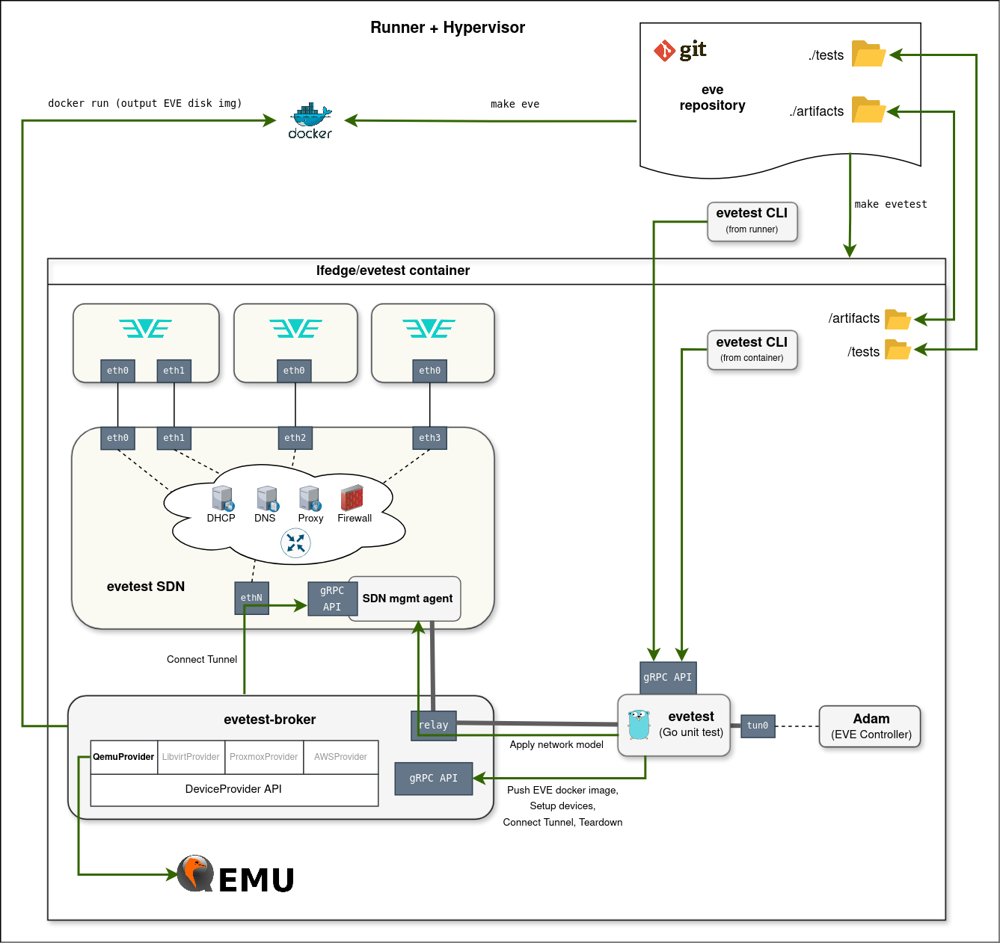
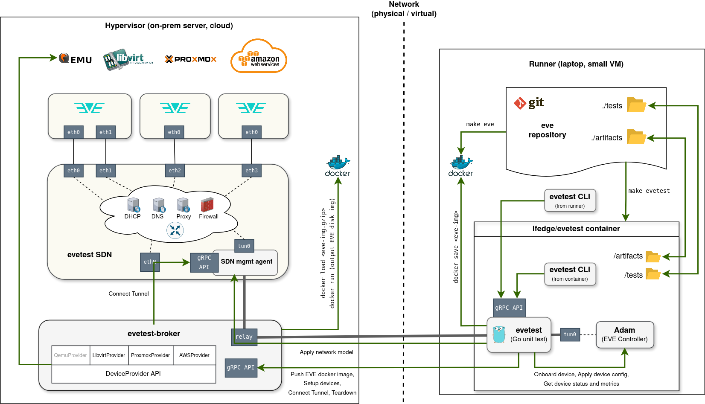
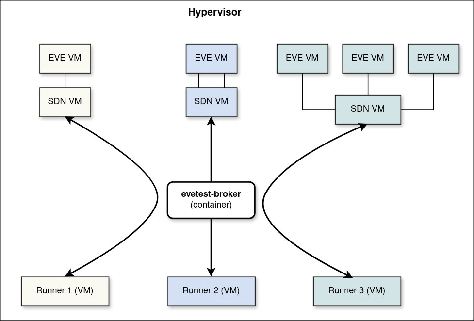

# EVETest Framework

EVETest (or simply "evetest") is a next-generation integration testing framework
for [EVE-OS](https://github.com/lf-edge/eve), designed to replace
[Eden](https://github.com/lf-edge/eden). It enables comprehensive integration testing
using virtualization, supports complex network scenarios via a programmable SDN,
and provides a simplified developer experience.

Tests are standard Go tests that live in the EVE repository alongside the code they
test. Running a test requires a single command:

```bash
make evetest NAME=<test-name>
```

For a detailed architectural overview, see [PROPOSAL.pdf](PROPOSAL.pdf).

## Prerequisites

- **GNU Make**
- **Docker (or compatible container runtime)**
- **EVE container image** already built (`make eve` from the EVE repo root), or a
  published `lfedge/eve` image matching the version you want to test
- **Go 1.22+** (only needed if installing the evetest CLI locally)
- **Nested virtualization** support in your CPU/hypervisor (for all-in-one mode)

## Quick Start

```bash
# From the EVE repository root

# 1. Build the EVE image (if testing local changes)
make eve

# 2. Run the test
#    Execution can be customized using EVETEST_* environment variables.
#    The NAME variable (or EVETEST_NAME) is mandatory and must reference
#    the name of a test or test suite in the ./tests directory.
EVETEST_LOG_LEVEL=debug make evetest NAME=TestBootstrapWithLastResort

# 3. (Optional) Pipe through gotestfmt for pretty output
go install github.com/gotesttools/gotestfmt/v2/cmd/gotestfmt@latest
EVETEST_LOG_LEVEL=debug make evetest NAME=TestBootstrapWithLastResort | gotestfmt
```

## Writing Tests

### Test Structure

Every test follows the same pattern:

```go
func TestMyFeature(test *testing.T) {
    // 1. Initialize the framework and obtain a wrapped test handle for assertions.
    //    Use this handle instead of the original test object.
	//    Ensure resources are released at the end.
    evetestT := evetest.Init(test)
    defer evetest.Close()

    // 2. (Optional) Define configurable parameters.
    //    You can use existing parameters (e.g., HypervisorParameter) or define
    //    new test-specific parameters via TestParameterDefinition.
    //    Parameters can be set through environment variables
    //    (`EVETEST_<param-key>`) or assigned directly within a test suite.
    evetest.DefineTestParameters(
        evetest.HypervisorParameter(),
        evetest.TestParameterDefinition{
            Key:          "MY_PARAM",
            DefaultValue: "default-value",
            Description:  "Controls some test behavior",
        },
    )

    // 3. (Optional) Get parameter values set for this test execution.
    hypervisor := evetest.GetHypervisorParameterValue()
    myParamValue := evetest.GetTestParameter[string]("MY_PARAM")

    // 4. Specify required devices and network model, then call Setup.
	//    Test is skipped if requirements cannot be satisfied.
    evetest.Setup(
        evetest.RequireEdgeDevice{
            Name:           "dev1",
            MinCPUs:        4,
            WithHypervisor: evetest.GetHypervisorParameterValue(),
        },
        evetest.RequireNetworkModel{
            NetworkModel: netmodels.SingleEthWithDHCP,
        },
        evetest.RequireInternetConnectivity{}
    )

    // 5. Obtain a handle to the device and interact with it.
    //    Multiple devices can also be requested and used (e.g., for clustering tests).
    device := evetest.GetEdgeDevice("dev1")

	// 6. Build and apply the device configuration.
    devConfig := evetest.NewEdgeDeviceConfig("dev1")
    dhcpNet := devConfig.AddNetwork(evetest.DHCPNetworkConfig{
        NetworkType: evecommon.NetworkType_V4,
    })
    devConfig.AddNetworkAdapter(evetest.NetworkAdapterConfig{
        LogicalLabel:  "eth0",
        PhysicalLabel: "eth0",
        InterfaceName: "eth0",
        NetworkUUID:   dhcpNet,
        Usage:         evecommon.PhyIoMemberUsage_PhyIoUsageMgmtAndApps,
    })
    device.ApplyConfig(devConfig, true)

    // 7. (Optional) Insert checkpoints at key points in the test to aid debugging
    //    and inspection. You can stop the test at a checkpoint to examine the
    //    EVE device state and other runtime information through evetest CLI.
    evetest.Checkpoint("config-applied")

    // 8. Perform assertions to verify the resulting device state.
    //    Any assertion framework can be used; Gomega is shown as an example.
    var dpcl pillartypes.DevicePortConfigList
    evetest.ReadPublication(device, "nim", &dpcl, "global")
    t := NewGomegaWithT(evetestT)
    t.Expect(dpcl.PortConfigList).To(HaveLen(1))

    // Continue repeating steps 6–8 as needed to test the desired scenario.
}
```

### Init and Close

`evetest.Init(t)` initializes the framework: it starts the Adam controller, connects
to the broker, and launches the gRPC server. It returns a **wrapped test handle** that
should be used for assertions instead of the original `testing.T`.
It must be called first in every test.

`evetest.Close()` tears down all resources. Always defer it immediately after `Init`.
When running inside a test suite, `Close` is a no-op for intermediate tests -- resources
are reused across the suite and torn down only after the last test.

### Test Parameters

Parameters make tests configurable without code changes. They are resolved in order:

1. Value set by the test suite (if running in a suite)
2. Environment variable `EVETEST_<KEY>` (e.g., `EVETEST_HYPERVISOR=kvm`)
3. Default value from the parameter definition

```go
evetest.DefineTestParameters(
    evetest.HypervisorParameter(),           // pre-defined: key "HYPERVISOR"
    evetest.FilesystemParameter(),           // pre-defined: key "FILESYSTEM"
    evetest.TPMParameter(),                  // pre-defined: key "TPM"
    evetest.TestParameterDefinition{         // custom parameter
        Key:          "MY_PARAM",
        DefaultValue: true,
        Description:  "Enable some feature",
    },
)

hypervisor := evetest.GetHypervisorParameterValue()
myParam := evetest.GetTestParameter[bool]("MY_PARAM")
```

Custom enum-like types can implement the `FromStringer` interface
(`FromString(string) error`) to be used as parameter types.
See `HypervisorParameter` for an example.

### Test Requirements and Setup

`evetest.Setup(requirements...)` declares what the test needs. The framework handles
all the behind-the-scenes work: building EVE images, creating VMs, configuring
networks, waiting for devices to boot and onboard, and establishing tunnels for
seamless connectivity between EVE devices, Adam controller and the test framework itself.

**RequireEdgeDevice** -- deploy an EVE device VM:

```go
evetest.RequireEdgeDevice{
    Name:              "dev1",          // logical name to reference the device
    MinCPUs:           4,               // default: 4
    MinRAMInMB:        4096,            // default: 4096
    MinDiskSizeInMB:   8192,            // default: 8192
    WithHypervisor:    evetest.HypervisorKVM,
    WithFilesystem:    evetest.FilesystemZFS,
    WithTPM:           true,
    DeviceReusePolicy: evetest.CreateFromScratchWithLiveImage,
}
```

The `DeviceReusePolicy` controls how existing devices from a previous test (in a suite)
are handled. Devices are only reused if they also satisfy the requirements of the next
test; those that do not match the next test’s requirements are torn down and not reused.

| Policy | Behavior |
|--------|----------|
| `UseAsIs` | Keep existing state |
| `RebootEdgeDevice` | Reboot the device |
| `ResetDeviceConfig` | Clear app settings, preserve network config |
| `ResetDeviceConfigAndReboot` | Clear settings and reboot |
| `ReonboardEdgeDevice` | Force re-onboarding |
| `CreateFromScratchWithLiveImage` | Recreate VM with live image |
| `CreateFromScratchWithInstaller` | Recreate VM using installer image |

**RequireNetworkModel** -- configure the SDN network environment:

```go
evetest.RequireNetworkModel{
    NetworkModel: netmodels.SingleEthWithDHCP,
}
```

Network models are declarative descriptions of the network topology: ports, bridges,
VLANs, DHCP/DNS servers, firewalls, proxies, and more. See the `tests/netmodels/`
directory for examples.

**RequireInternetConnectivity** -- verify and require Internet access:

```go
evetest.RequireInternetConnectivity{
    RequireIPv6: true,  // optional: also require IPv6
}
```

If any requirement cannot be satisfied, the test is marked as skipped.

### Building and Applying Configuration

After `Setup` returns, all required devices are powered on and onboarded.
Next, build the device configuration programmatically:

```go
// Add networks
dhcpNet := devConfig.AddNetwork(evetest.DHCPNetworkConfig{...})
staticNet := devConfig.AddNetwork(evetest.StaticNetworkConfig{...})

// Add network adapters
devConfig.AddNetworkAdapter(evetest.NetworkAdapterConfig{...})

// Set device-wide config properties
devConfig.SetConfigProperties(cfgProps)

// Apply and wait for the device to acknowledge
device := evetest.GetEdgeDevice("dev1")
device.ApplyConfig(devConfig, true) // true = wait for acknowledgment
```

You can modify and re-apply the configuration multiple times during a test to verify
how EVE reacts to configuration changes.

### Interacting with Devices

The `EdgeDevice` object provides methods for interacting with the running EVE device:

```go
device := evetest.GetEdgeDevice("dev1")

// Run commands via SSH
stdout, stderr, err := device.RunShellScript("uptime", timeout, stdoutWatchdogTimeout)

// Read EVE's internal published state (pubsub)
var dpcl pillartypes.DevicePortConfigList
evetest.ReadPublication(device, "nim", true, "global", &dpcl)

// Read all publications of a type
items := evetest.ReadAllPublications[pillartypes.AppInstanceStatus](
    device, "zedmanager", false)

// Get the latest device info/metrics (or nil if not yet received)
info := device.GetDeviceInfo()
metrics := device.GetDeviceMetrics()

// Watch for info/metrics updates in real-time
updates, stop := device.WatchDeviceInfo()
defer stop()
for msg := range updates { ... }

// Apply configuration changes
device.ApplyConfig(ctx, newConfig, true)

// Reboot
device.SoftReboot(ctx)
device.HardReboot(ctx)
```

### Checkpoints

Insert named checkpoints to create pause points for interactive debugging:

```go
evetest.Checkpoint("setup-done")
// ... more test logic ...
evetest.Checkpoint("config-applied")
// ... more test logic ...
evetest.Checkpoint("another-import-point-of-tested-scenario")
```

When `EVETEST_PAUSE_ON_CHECKPOINT` matches a checkpoint name, the test pauses there.
Use the CLI to inspect state, then run `evetest continue` to resume.

## Test Suites

Test suites group multiple tests for sequential execution with resource reuse.
When tests in a suite share similar requirements, the framework reuses existing VMs
instead of recreating them for each test.

```go
func TestBootstrapSuite(test *testing.T) {
    evetest.Init(test)
    defer evetest.Close()

    // Suite-wide parameters (override individual test defaults)
    evetest.DefineTestParameters(
        evetest.HypervisorParameter(),
    )

    evetest.RunTestSuite(
        evetest.TestCase{
            Test: TestBootstrapWithLastResort,
            Variants: []evetest.TestVariant{
                {
                    Name: "LastResortDisabled",
                    Parameters: []evetest.TestParameterValue{
                        {Key: "LAST_RESORT_ENABLED", Value: false},
                    },
                },
                {
                    Name: "LastResortEnabled",
                    Parameters: []evetest.TestParameterValue{
                        {Key: "LAST_RESORT_ENABLED", Value: true},
                    },
                },
            },
        },
        evetest.TestCase{
            Test: TestDHCPIPv4Only,  // no variants: runs once with defaults
        },
    )
}
```

Each variant runs as a Go subtest (`t.Run`). The `EVETEST_SUITE_MAX_FAILURES` variable
controls early termination: `1` (default) aborts after the first failure, `-1` runs
all tests regardless of failures.

Run a suite like any other test:

```bash
make evetest NAME=TestBootstrapSuite
```

## Running Tests

### Basic Usage

```bash
# Run a single test
make evetest NAME=TestBootstrapWithLastResort

# Run a test suite
make evetest NAME=TestBootstrapSuite

# With debug logging and formatted output
EVETEST_LOG_LEVEL=debug make evetest NAME=TestBootstrapSuite | gotestfmt

# With a specific EVE version
EVETEST_EVE_VERSION=0.0.0-my-branch-abc123-kvm-amd64 \
    make evetest NAME=TestDHCPIPv4Only

# Collect artifacts (logs, Adam DB snapshot, collect-info from each device on failure, etc.)
EVETEST_COLLECT_ARTIFACTS=/tmp/evetest-artifacts \
    make evetest NAME=TestDHCPIPv4Only
```

### Debugging with Pause

**Pause on failure** -- when a test fails, the environment stays up for inspection:

```bash
EVETEST_PAUSE_ON_FAILURE=true make evetest NAME=TestDHCPIPv4Only

# In another terminal:
evetest status            # see what happened
evetest eve ssh           # SSH into the EVE device
evetest eve logs -f       # tail logs
evetest continue          # let the test tear down
# or
evetest exit              # tear down and exit immediately
```

**Pause on checkpoint** -- stop at a specific point in the test:

```bash
EVETEST_PAUSE_ON_CHECKPOINT=config-applied \
    make evetest NAME=TestBootstrapWithLastResort

# In another terminal:
evetest eve config        # inspect the submitted config
evetest eve info          # check device status
evetest continue          # resume the test
# or
evetest continue --until setup-done  # resume until a different checkpoint
```

### Iterating on Test Code

Since `/tests` is mounted from the host, you can edit test files and re-run without
rebuilding the container:

```bash
# Test is paused (on failure or checkpoint)
# Edit the test file on your host...
evetest restart           # re-compile and re-run, reusing existing VMs
```

## EVETest CLI

The CLI provides runtime interaction with a running evetest instance. It communicates
via gRPC with the evetest container.

Install it on your host:

```bash
make install-cli
```

Or use it from inside the container (`docker exec -it evetest-<API-port> bash`).

### Shell Auto-Completion

```bash
# bash
evetest completion bash > evetest-completion.bash
sudo mv evetest-completion.bash /etc/bash_completion.d/evetest

# zsh
evetest completion zsh > ~/.zsh/completions/_evetest

# fish
evetest completion fish > ~/.config/fish/completions/evetest.fish
```

### Test Control

```bash
evetest status                          # current test status
evetest continue                        # resume a paused test
evetest continue --until <checkpoint>   # resume until a specific checkpoint
evetest restart                         # re-run the test (with potentially updated test code)
evetest exit                            # tear down and exit
```

### EVE Device Commands

All EVE commands accept `--devicename <name>` (defaults to the first device).

```bash
evetest eve info [-f]                   # device info (follow with -f)
evetest eve metrics [-f]                # device metrics
evetest eve logs [-f]                   # device logs
evetest eve config                      # get current device config
evetest eve console-output              # full console/boot log

evetest eve app-info <app> [-f]         # application info
evetest eve app-metrics <app> [-f]      # application metrics
evetest eve app-logs <app> [-f]         # application logs
evetest eve flow-logs <app> [-f]        # application flow logs
evetest eve ni-info <ni> [-f]           # network instance info
evetest eve ni-metrics <ni> [-f]        # network instance metrics

evetest eve ssh [command...]            # SSH into EVE device
evetest eve scp --from-device src dst   # copy files from EVE
evetest eve scp --to-device src dst     # copy files to EVE
evetest eve console                     # enter interactive console (telnet)
evetest eve collect-info                # collect diagnostic tarball

evetest eve hard-reboot                 # hard reboot
evetest eve soft-reboot                 # soft reboot
```

### SDN Commands

```bash
evetest sdn status                      # SDN status and config errors
evetest sdn net-model                   # current network model
evetest sdn graph                       # config graph (Graphviz dot)
evetest sdn logs                        # stream SDN logs
evetest sdn ssh [command...]            # SSH into SDN VM
```

### Cluster Commands

```bash
evetest cluster info [-f]               # Kubernetes cluster info
evetest cluster metrics [-f]            # Kubernetes cluster metrics
```

## Configuration

All configuration is done through environment variables; there are no configuration files.
The framework provides sensible defaults; you only need to set variables when you want
non-default behavior.

### Essential Variables

| Variable | Description | Default |
|----------|-------------|---------|
| `EVETEST_NAME` | Test or suite name to run (**required**) | -- |
| `EVETEST_EVE_VERSION` | EVE version to test | current repo HEAD |
| `EVETEST_LOG_LEVEL` | Framework log level (`debug`, `info`, `warn`) | `info` |
| `EVETEST_COLLECT_ARTIFACTS` | Host path for artifacts (logs, collect-info) | -- |

### Debugging Variables

| Variable | Description | Default |
|----------|-------------|---------|
| `EVETEST_PAUSE_ON_FAILURE` | Pause when a test fails | `false` |
| `EVETEST_PAUSE_ON_CHECKPOINT` | Pause at the named checkpoint | -- |
| `EVETEST_SUITE_MAX_FAILURES` | Max failures before aborting suite (`-1` = unlimited) | `1` |

### Deployment Variables

| Variable | Description | Default |
|----------|-------------|---------|
| `EVETEST_BROKER_ADDRESS` | Broker IP (unset = embedded broker) | -- |
| `EVETEST_BROKER_PORT` | Broker gRPC port | `50221` |
| `EVETEST_BROKER_DEVICE_PROVIDER` | `libvirt` or `qemu` | `libvirt` |
| `EVETEST_API_PORT` | gRPC API port exposed by evetest container | `50021` |

When running multiple evetests in parallel on the same host, each test must use
a different `EVETEST_API_PORT` to avoid port conflicts.
When running the `evetest` CLI against an instance using a non-default API port,
set `EVETEST_API_PORT` in the same terminal session beforehand.

### Version Overrides

| Variable | Description | Default |
|----------|-------------|---------|
| `EVETEST_EVE_REPO` | EVE image repository | `lfedge/eve` |
| `EVETEST_ADAM_VERSION` | Adam controller version | `0.0.57` |
| `EVETEST_SDN_VERSION` | SDN emulator version | `v0.0.1` |

### Broker Variables (for distributed mode)

| Variable | Description | Default |
|----------|-------------|---------|
| `EVETEST_BROKER_LIBVIRT_URI` | Libvirt connection URI | `qemu:///system` |
| `EVETEST_BROKER_IMAGE_DIR` | VM image storage directory | `/var/lib/libvirt/images` |
| `EVETEST_SDN_UPLINK_IPV4_SUBNET` | IPv4 subnet for SDN uplink | `192.168.170.0/24` |
| `EVETEST_SDN_UPLINK_IPV6_SUBNET` | IPv6 subnet for SDN uplink | `fd11:778b:03dd:2222::/64` |
| `EVETEST_BROKER_PROXY_CA_CHAIN` | Proxy CA certificate chain file | -- |

## Deployment Modes

### All-in-One Mode

In all-in-one mode, everything runs within a single Docker container: the test runner,
Adam controller, an embedded broker, and all VMs (EVE + SDN) are created using QEMU
inside the container.

This is the default mode when `EVETEST_BROKER_ADDRESS` is not set.



```bash
make evetest NAME=TestDHCPIPv4Only
```

The container is started with `/dev/kvm` mounted, `NET_ADMIN` capability, and access
to the Docker socket. The embedded broker uses QEMU directly to start and manage EVE and
SDN VMs.

Best for:
- Local development on laptops
- Learning the framework and experimenting with tests
- Quick iteration during test development
- Scenarios where you don't have access to a remote hypervisor

Requires nested virtualization support.

### Distributed Mode

In distributed mode, the evetest container runs on one machine (a CI runner or your
laptop) while the broker runs on a separate, (typically more powerful) hypervisor server.
EVE VMs run directly on the host hypervisor, avoiding nested virtualization
(which would occur in All-in-One Mode when executed inside a virtualized CI runner).

The broker uses its device provider (typically libvirt) to create VMs and acts as a
tunnel proxy, forwarding IP packets between the evetest container and the SDN VM.
From the test's perspective, this is transparent -- the same test code works in both
modes.



```bash
# One-time setup on the hypervisor server:
sudo make setup-broker-user
make run-broker-container

# On the runner/laptop (192.168.1.100 is example of the server IP address):
EVETEST_BROKER_ADDRESS=192.168.1.100 make evetest NAME=TestDHCPIPv4Only
```

Best for:
- CI/CD pipelines (small runners, powerful hypervisors)
- Multiple developers/CI jobs sharing the same hypervisor infrastructure
- Resource-intensive tests (multi-device, cluster testing)

Multiple evetest instances can connect to the same broker concurrently. The broker
tracks resources per client and ensures isolation between concurrent tests.

Example: Running Evetest on a CI Server



## Architecture

EVETest consists of several components that communicate over gRPC:

### EVETest Container

The container is the execution environment where tests run. Inside it you'll find:
- The **Go test binary** executing your test code
- The **[Adam controller](https://github.com/lf-edge/adam)** -- EVE's open-source
  controller implementation
- The **evetest CLI** for interactive debugging (if you prefer not to install it directly
  on your host)
- Optionally, an **embedded broker** (in all-in-one mode)

The container mounts `/tests` from the EVE repo (allowing live test edits) and
optionally `/artifacts` for collecting outputs. It runs with `NET_ADMIN` capability
for network configuration and tunnel management.

Running tests inside a container ensures a consistent, isolated, and reproducible
environment. All dependencies (including QEMU) are encapsulated within the container,
eliminating version mismatch problems and preventing interference with the host system.

### Broker (`evetest-broker`)

The broker is the resource management and hypervisor abstraction layer. It translates
test requirements ("I need an EVE device with 4GB RAM and 2 network interfaces") into
actual VMs on a hypervisor.

Device management is implemented through a **provider interface**, allowing different
hypervisor backends to be plugged in and enabling future implementations for additional
platforms.

The broker currently supports the following **device providers**:
- **QEMU** — direct QEMU invocation, used in all-in-one mode
- **libvirt** — uses libvirt APIs, used in distributed mode

It manages the VM lifecycle (create, power on/off, reboot, destroy), caches EVE images
for reuse across tests, and acts as a tunnel proxy forwarding IP packets between the
evetest container and the SDN VM. This tunneling allows the evetest container to operate
without direct network connectivity to the VMs -- it only needs access to the broker.

### SDN (Software Defined Network)

The SDN is a lightweight LinuxKit-based VM that models physical network infrastructure
in software. It provides the network environment that EVE devices connect to.

Tests define a declarative **network model** specifying the topology: ports, bridges,
bonds, VLANs, DHCP servers, DNS servers, firewalls, HTTP proxies, SCEP servers, and
802.1X authentication. The SDN applies this model using standard Linux networking tools
(bridges, namespaces, iptables, dnsmasq, hostapd, etc.) and provides a realistic
environment for network testing.

The SDN is implemented as a VM (rather than a container) because it needs multiple
network namespaces for complex topologies and L2 connectivity with EVE VMs.

### EVETest CLI

A Cobra-based command-line tool for interacting with running test instances. It
communicates with the evetest container via gRPC and provides commands for inspecting
device state, viewing logs, SSH access, console access, and test flow control.

The CLI can run inside the container or on the host. Remote access commands
(`ssh`, `scp`, `console`) work transparently regardless of deployment mode -- the
framework handles tunnel and proxy setup automatically.

### Adam Controller

Adam is EVE's open-source controller implementation. It runs inside the evetest
container and handles device onboarding, configuration distribution, and collection
of device info, metrics, and logs. Tests interact with EVE devices through Adam,
and the framework subscribes to Adam's data streams to keep device state up to date.

## Makefile Targets

### User-facing

| Target | Description |
|--------|-------------|
| `make evetest` | Run a test (requires `NAME=...`) |
| `make build-container` | Build evetest + broker Docker images |
| `make build-broker-container` | Build broker Docker image only |
| `make build-sdn-container` | Build SDN VM container (requires linuxkit, with the `LINUXKIT` variable pointing to the binary) |
| `make install-cli` | Install the `evetest` CLI binary |
| `make proto-in-container` | Regenerate protobuf code (Docker-based) |
| `make setup-broker-user` | One-time setup for libvirt broker (requires sudo) |
| `make run-broker-container` | Start the broker container (distributed mode) |

### Internal

| Target | Description |
|--------|-------------|
| `make install-broker` | Install the `evetest-broker` binary |
| `make proto` | Regenerate protobuf code (requires local protoc) |

## Advanced Host Setup

### NetworkManager Interference (libvirt provider)

In the distributed deployment mode, you must prevent NetworkManager (if present) from
managing the xconnect bridges created by libvirt provider. This configuration must be
applied on the host running the broker; it is **not required** on the test-runner host
system or in the all-in-one deployment mode.

```bash
sudo vim /etc/NetworkManager/conf.d/99-evetest-unmanaged.conf
```

```ini
[device-evetest-xconnect-unmanaged]
match-device=interface-name:evetest-x-*
managed=0
```

These bridges are created to interconnect EVE VMs with the SDN VM and must not be managed
by the host.

```bash
sudo systemctl restart NetworkManager
```

### Enabling IPv6 Connectivity Tests

In all-in-one deployment mode, IPv6 connectivity between EVE devices and the controller
works out of the box and does not require any special host setup, even if the host system
itself does not have IPv6 connectivity.

However, tests that require IPv6 Internet access
(`RequireInternetConnectivity{RequireIPv6: true}`) will be skipped if the host
does not have IPv6 connectivity.

For tests requiring IPv6 Internet access, you must also:

1. **Enable IPv6 in Docker**

```bash
# Add to the docker daemon config (generate subnet using https://unique-local-ipv6.com/):
cat /etc/docker/daemon.json
{
    "ipv6": true,
    "fixed-cidr-v6": "fdbd:e2c4:bec9:8249::/64"
}
# Then restart docker daemon:
sudo systemctl restart docker
```

2. **Enable IPv6 forwarding and NAT66 on the host**

```bash
sudo sysctl -w net.ipv6.conf.all.forwarding=1
sudo modprobe ip6table_nat
sudo ip6tables -t nat -A POSTROUTING -o <egress-interface> -j MASQUERADE
```

Replace `<egress-interface>` with the host interface used for external connectivity.

## Contributing

### Directory Structure

```
evetest/
├── broker/             # Broker binary (VM lifecycle, tunnel proxy)
│   └── provider/       # Device provider implementations (QEMU, libvirt)
├── cli/                # EVETest CLI binary
├── constants/          # Shared constants and Viper config
├── controller/         # Adam controller client (Go wrapper around Adam REST API)
├── grpcapi/
│   ├── proto/          # Protobuf service definitions (broker.proto, sdn.proto, ...)
│   └── go/             # Generated Go code (do not edit manually)
├── logger/             # Logging utilities
├── protobuilder/       # Helpers for building protobuf config messages
├── sdn/
│   ├── vm/             # SDN agent (separate Go module, built into LinuxKit VM)
│   │   └── pkg/configitems/  # Network config item implementations
│   └── VERSION         # SDN version
├── utils/              # Shared utilities (crypto, networking, etc.)
├── vendor/             # Vendored dependencies for the main module
├── VERSION             # Evetest + broker version
├── Makefile
├── Dockerfile.evetest  # Evetest container image
└── Dockerfile.broker   # Broker container image

../tests/               # Integration tests (separate Go module, mounted into container)
├── networking/         # Network-related tests and test suites
├── cluster/            # Kubernetes cluster tests
├── upgrade/            # EVE upgrade tests
└── netmodels/          # Reusable network model definitions for tests
```

### Go Modules

The project consists of three Go modules:

| Module | Path | Description |
|--------|------|-------------|
| `github.com/lf-edge/eve/evetest` | `evetest/` | Main framework (harness, EdgeDevice API, gRPC server, broker, CLI) |
| `github.com/lf-edge/eve/evetest/sdn/vm` | `evetest/sdn/vm/` | SDN agent built into the LinuxKit VM |
| `github.com/lf-edge/eve/tests` | `tests/` | Integration tests |

**Dependency graph:**

```
tests  ──depends on──▶  evetest  ◀──depends on──  sdn/vm
```

Both `tests` and `sdn/vm` use `replace` directives in their `go.mod` to point to
the local evetest source:

```
replace github.com/lf-edge/eve/evetest => ../evetest   // in tests/go.mod
replace github.com/lf-edge/eve/evetest => ../../        // in sdn/vm/go.mod
```

All three modules vendor their dependencies. When you change dependencies in any
module, run `go mod tidy && go mod vendor` in that module's directory.

### Version Files

Two `VERSION` files track component versions. Increment them when making changes
to the corresponding component:

| File | Covers | Used by |
|------|--------|---------|
| `evetest/VERSION` | Evetest framework, broker, CLI | `lfedge/evetest` and `lfedge/evetest-broker` Docker image tags |
| `evetest/sdn/VERSION` | SDN agent and VM image | `lfedge/evetest-sdn` Docker image tag |

### What to Rebuild When

Different changes require different rebuild steps. The table below summarizes what
needs to happen after each type of change:

| What changed | What to do |
|--------------|------------|
| **Test code** (`../tests/`) | Nothing -- tests are mounted into the container and compiled there. Just re-run `make evetest`. |
| **Evetest framework** (root package: `harness.go`, `edgedevice.go`, `devconfig.go`, ...) | Run `go mod tidy && go mod vendor` in `../tests/` to pick up changes. If the change also affects `sdn/vm` (e.g., a shared package it imports), update its vendor too. Rebuild the evetest container (`make build-container`). Bump `VERSION`. |
| **gRPC API** (`grpcapi/proto/`) | Regenerate Go code (`make proto-in-container`). Then rebuild whichever containers consume the changed API -- typically the evetest container and potentially the broker container and SDN VM. Bump `VERSION` and/or `sdn/VERSION` as appropriate. |
| **Broker** (`broker/`) | Rebuild the broker container (`make build-broker-container`) and the evetest container (`make build-container`, since all-in-one mode embeds the broker). Bump `VERSION`. |
| **CLI** (`cli/`) | Reinstall the CLI on the host (`make install-cli`). Rebuild the evetest container (`make build-container`) to update the CLI inside it. Bump `VERSION`. |
| **SDN agent** (`sdn/vm/`) | Rebuild the SDN container (`make build-sdn-container`, requires linuxkit). Bump `sdn/VERSION`. To use the new version, either set `EVETEST_SDN_VERSION` when running tests or update `DefaultSDNVersion` in `constants/` so the new version is used by default. |
| **Controller client** (`controller/`) | Rebuild the evetest container (`make build-container`). Bump `VERSION`. |
| **Constants** (`constants/`) | May affect all components. Rebuild the evetest container and, if the SDN imports the changed constant, rebuild the SDN container. Bump `VERSION` and/or `sdn/VERSION`. |
| **Shared utilities** (`utils/`) | Rebuild the evetest container. If `sdn/vm` imports the changed utility, also rebuild the SDN container. Bump `VERSION` and/or `sdn/VERSION`. |

As a rule of thumb: if you change anything under `evetest/` (other than `sdn/vm/`),
bump `evetest/VERSION`. If you change anything under `evetest/sdn/vm/`, bump
`evetest/sdn/VERSION`.
