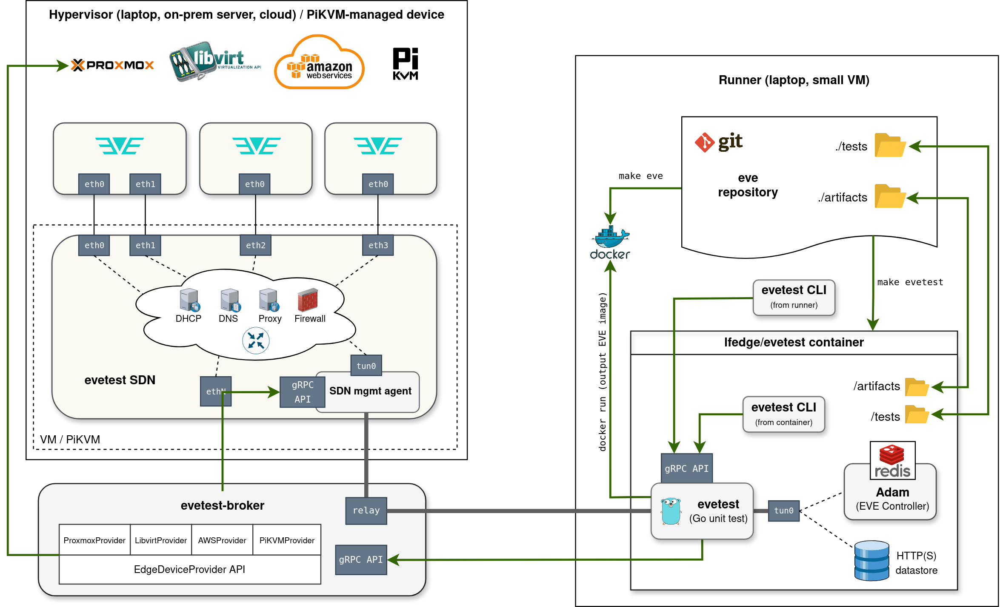

"evetest" framework proposal (replacement for eden eventually)
==============================================================

Issues with eden which evetest should address
---------------------------------------------
- simplify configuration, CLI and improve overall user-experience (eden is quite complicated to setup)
- avoid running EVE VM inside runner VM, otherwise we have too many levels of nested virtualization
- allow programmable network configurations (to improve test coverage of EVE networking)
- allow writing tests as Go tests with easy to use interface
- support different compute providers (proxmox, libvirt, public cloud, maybe even PiKVM-managed HW device)
- allow running multiple tests at the same time from the same host (avoid port and other collisions)
- allow to easily create test suites (in Go)
- have tests (and preferably also test framework) inside the EVE repo
    - this allows to wrap new-feature implementation together with test(s) inside the same PR,
      rather than creating tests separately in another repo (later, or more commonly never)
    - avoids making new eden releases everytime we fix something in eden or add a new test
    - avoid cross references between eve and eden repo and the complicated reusable github workflows
- avoid naming with religious references
    - religion and politics better to be avoided
    - IMHO renaming Adam to OpenEVEController or something like that would also make sense

Basic ideas behind evetest:
---------------------------
- use Go testing framework for writing EVE integration tests
- this will be open-source test framework (like eden), so we will use Adam, not ZedCloud
- defines only few configuration options (unlike eden, to keep it simple), specified
  using Makefile args / env. variables (or maybe a small config file, but I think it is unnecessary)
- evetest API should be simple:
    - `evetest.Init` method called at the beginning of each test, preparing the test framework
    - (defer) `evetest.Close` method deallocating all resources, checking for unexpected EVE reboots,
      collecting artifacts (logs, collect-info, etc.)
    - `evetest.Setup` method where test specifies it requirements (how many EVE devices, min. CPU/mem/disk
      for each device, override.json/bootstrap-config.pb to inject, SDN network model, etc.)
        - outcome of Setup is onboarded EVE device(s) (or failure)
    - `evetest.GetEdgeDevice(devName)` method to get object representing an EVE device
        - methods to get/change config, get info/metrics, run command over ssh, reboot, etc.
    - `evetest.RunTestSuite` will allow to define a test suite (again as a regular Go test)
    - gomega can be used to define asserts, but this will not be required
      (developer can choose preferred package for asserts, if any)
- evetest runs as a container, inside running Adam, Redis (DB for Adam) and executing `go test`
  on the selected test
    - container isolates this from the hosts and therefore avoids messing things up
    - containerization also allows to run multiple evetest instances in paraller from the same runner
- evetest contacts evetest-broker, potentially running on another host, which facilitates
  creation of EVE devices and the SDN
    - broker keeps track of resources allocated for a given evetest instance
    - broker makes sure that resources are not over-provisioned
    - broker abstracts "device provider" using an interface
        - there can be implementation for libvirt provider, proxmox provider, AWS/Azure/.. provider,
          or even baremetal provider (implemented for example as PiKVM-managed devices)
    - broker relays IP packets of a point-to-point tunnel created between the SDN and
      the evetest container
        - this avoids IP conflicts between physical and virtual networks created by tests
        - it also means that test runner only needs connectivity to broker and the broker
          needs connectivity to the device provider (but direct connectivity from the runner
          to the provider is not required)
- evetest provides CLI, which talks to an evetest container instance
    - can be run from the host or inside the evetest container
    - allows to troubleshoot running/paused/failed test
    - this is for developer (not so much for CI/CD)

Examples
--------
- few (networking) test were already prepared, see [netinst_test.go](../tests/networking/netinst_test.go)
  and [bootstrap_test.go](../tests/networking/bootstrap_test.go)
- networking test suite examples can be found in [testsuite_test.go](../tests/networking/testsuite_test.go)

Configuration variables:
------------------------
- `EVETEST_NAME`
    - name of the test or test suite to run
    - read by evetest container
- `EVETEST_SUITE_MAX_FAILURES`
    - if running a test suite, this determines how many tests in the suite can fail
      until evetest gives up
    - negative number means that evetest will run all tests in the suite regardless
      of outcomes
    - by default 1 ?
- `EVETEST_LOG_LEVEL`
    - this is log level for the evetest framework (not for EVE)
    - read by both evetest container and evetest-broker
- `EVETEST_BROKER_ADDRESS`
    - IP address where evetest-broker can be contacted
    - read by evetest container
- `EVETEST_COLLECT_ARTIFACTS`
    - relative path to a sub-directory (cannot use `..`) where test artifacts will be stored
    - this will be mounted to evetest container under `/artifacts`
    - read by evetest container
- `EVETEST_PAUSE_ON_CHECKPOINT`
    - references point in the test (defined using evetest.Checkpoint()) where
      the test execution should pause
    - read by evetest container
- `EVETEST_PAUSE_ON_FAILURE`
    - if something fails, pause, do not clean anything, let user to enter
      the container, troubleshoot, then run `evetest continue` or `evetest exit` (the same effect)
    - read by evetest container
- `EVETEST_API_PORT`
    - port on which the gRPC API of the evetest is exposed
    - it is used by evetest CLI to connect to a running evetest instance
    - there will be a default value
    - allows to start mutliple evetest containers and avoid port conflict between them
- `EVETEST_BROKER_PORT`
    - port on which evetest-broker exposes its gRPC API (where evetest container connects to)
    - read by evetest-broker and evetest container
    - there will be some default port number
- `EVETEST_EVE_IMG_RETENTION_MINUTES`
    - duration in minutes for which an EVE container image (lfedge/eve) obtained by evetest-broker
      will be kept even after it is no longer used by any running evetest
    - this allows the same eve image to be reused by another workflow started later
    - there will be a default value
- `EVETEST_EVE_VERSION`
    - specify EVE version to test
    - by default, evetest tests the version of EVE corresponding to the currently checked-out
      commit in the local EVE repository, including any uncommitted local code changes
    - read by evetest container
- `EVETEST_EVE_REPO`
    - by default "lfedge"
    - one can change this to pull a given `EVETEST_EVE_VERSION` from a different repo
    - read by evetest container
- `EVETEST_ADAM_VERSION`
    - specify version of the Adam controller to run
    - there will be some default value specified in evetest dir, which we will update when needed
    - read by evetest container
- `EVETEST_ADAM_REPO`
    - by default "lfedge"
    - one can change this to pull a given `EVETEST_ADAM_VERSION` from a different repo
    - read by evetest container
- `EVETEST_SDN_VERSION`
    - specify version of the SDN to run
    - there will be some default value specified in evetest dir, which we will update when needed
    - read by evetest container
- `EVETEST_SDN_REPO`
    - by default "lfedge"
    - one can change this to pull a given `EVETEST_SDN_VERSION` from a different repo
    - read by evetest container

Github workflow:
----------------
- Run one test suite per workflow
- inside the runner (can be a small VM):
    - checkout EVE repo
    - load lfedge/eve container from the github cache (was built by Build workflow)
    - set env variables `EVETEST_*`, definitely at least:
        - `EVETEST_NAME` (with the test suite name)
        - `EVETEST_BROKER_ADDRESS`
        - `EVETEST_COLLECT_ARTIFACTS`
    - run `make evetest`
    - publish all artifacts from dir pointed to by `EVETEST_COLLECT_ARTIFACTS`
    - this can be useful to show test results separately (using output from `go test -json`):
       - https://github.com/dorny/test-reporter

Developer workflow:
-------------------
- inside EVE repo checkout branch/version/commit to test
- build eve container with `make eve`
- make sure that broker is running (can be on the same machine or somewhere else)
    - set env variables `EVETEST_*`, definitely at least:
        - `EVETEST_BROKER_ADDRESS`
        - `EVETEST_LOG_LEVEL`
        - `EVETEST_PAUSE_ON_CHECKPOINT` or `EVETEST_PAUSE_ON_FAILURE`
        - `EVETEST_API_PORT` (if the default value is already used on the dev machine)
        - possibly `EVETEST_COLLECT_ARTIFACTS`
    - run `make evetest`
    - use evetest CLI directly from the host or from inside the container to troubleshoot

SDN
---
- we will copy-paste eden/sdn to evetest/sdn and make only few enhancements:
- REST API converted to gRPC API for unification with other interfaces between evetest components
- SDN will be reporting if there is connectivity to a given endpoint
 (google.com, controller IP - this will be RPC method param)
    - separately for IPv4 and IPv6
    - test will be skipped if it requires Internet connectivity for EVE (over IPv4 or IPv6)
      but SDN does not provide that
- provides gRPC method to establish point-to-point IP tunnel, with raw IP packets forwarded
  over a TCP connection
    - creates tunnel interface, assigns the IP addresses and routes (defined in the request)
    - receives/sends tunnel IP packets over this TCP connection (from a separate Go routine)
    - from SDN perspective, tunnel networks are part of "Outside networks"
      (just like the host interface)
- SDN code will be in eve repo, under evetest
- it will be published as `lfedge/evetest-sdn:<version>`

eve/Makefile, target "make evetest"
-----------------------------------
- reads mandatory arg (or env variable) `EVETEST_NAME` (also accepts just `NAME` as Makefile arg)
- reads mandatory arg (or env variable) `EVETEST_BROKER_ADDRESS=<ip/hostname>`
    - optionally also accepts:
        - `EVETEST_BROKER_PORT` (default some number)
- reads optional arg `EVETEST_COLLECT_ARTIFACTS=<subdir>`, with a relative path
  to subdirectory where artifacts will be collected
- reads (optional) args `EVETEST_ADAM_VERSION` (there will be a default version in evetest/ADAM_VERSION)
    - also accepts `EVETEST_ADAM_REPO` to change the default lfedge
- builds evetest using evetest/Dockerfile
    - tag is combination of evetest/VERSION and `EVETEST_ADAM_VERSION`
    - passes ARG `EVETEST_ADAM_VERSION` (used in FROM `lfedge/adam:<version>`)
    - usually this will be cached and therefore very quick
- runs built container
    - directory `./tests` is mounted as `/tests`
    - runs with NETADMIN rights (or simply as privileged)
    - mounts docker socket inside
    - if `EVETEST_COLLECT_ARTIFACTS` is defined:
        - creates that subdir and all dirs in the path which are missing
        - mounts that subdir as `/artifacts`
    - passes in all `EVETEST_*` variables into the container's env variable space, examples
        - `EVETEST_NAME`
        - `EVETEST_EVE_VERSION`
            - by default `<EVETEST_EVE_HEAD_VERSION>`
        - `EVETEST_EVE_REPO` (by default lfedge)
            - one can change this to pull a given `EVETEST_EVE_VERSION` from a different repo
        - `EVETEST_SDN_REPO`
        - `EVETEST_SDN_VERSION`
        - `EVETEST_PAUSE_ON_CHECKPOINT`
            - where to stop execution until user runs `evetest continue [until <another-checkpoint>]`
        - `EVETEST_LOG_LEVEL` (log level for evetest itself)
        - all the other user-defined test parameters, such as `EVETEST_HYPERVISOR`, `EVETEST_FILESYSTEM`, etc.
        - `EVETEST_PAUSE_ON_FAILURE`
            - if something fails, pause, do not clean anything, let user to enter
              the container, troubleshoot, then run `evetest continue` or `evetest exit` (the same effect)
    - also passes locally checked-out EVE version as variable `EVETEST_EVE_HEAD_VERSION`
- prints how to enter the container's shell (bash) or install evetest CLI directly in the host

evetest/Dockerfile
------------------
- base is Golang container or something with basic utilities (Go, bash, tcpdump, strace, etc.)
- pulls Adam binary from the adam container
- also redis is needed - take it from the redis container
- copies evetest dir
- builds and installs evetest CLI binary
- creates empty dir `/tests` and uses it as workdir
- creates empty dir `/artifacts`
- make sure that evetest dir and everything not needed in the final container is not included

evetest container default CMD
-----------------------------
- shell script that runs `go test -json -run ^{EVETEST_NAME}$`
- if `evetest restart` was triggered, the shell script re-build and re-runs the same test
  (which might have changed since tests are mounted into the container from the host)

evetest binary (the CLI)
------------------------
- all commands mostly just call the evetest gRPC APIs
- available commands:
    - `evetest` (without command)
        - prints version (of the CLI, evetest and evetest-broker) and help
        - it may print warning if CLI is behind evetest in version
        - if running from the host, maybe it can also iterate over all running docker
          containers and discover all instances of evetest (and ports they listen on)
    - `evetest continue [until <another-checkpoint>]`
        - using gRPC API it tells the Go test to continue
          (until the end of the test or only until a given next checkpoint)
    - `evetest restart`
        - restart the same test
        - but EVE cannot be changed, only the test itself (it is mounted to the container)
        - better than recreating all devices and images -- they can be reused
    - `evetest exit`
        - Go test will trigger the `evetest.Close` method
            - tell broker to deallocate all resources associated with the test
            - exit the Go test process
    - `evetest status`
        - basic info, like name of the test running, checkpoint or failure where it paused (unless it is running)
        - EVE devices deployed (device names)
        - etc.
    - `evetest cluster info`
        - info about the whole cluster (if EVE devices are clustered)
    - `evetest cluster metrics`
        - metrics for the whole cluster (if EVE devices are clustered)
    - `evetest eve [--devicename <devname>] config`
        - prints config submitted through the controller
    - `evetest eve [--devicename <devname>] info [-f/--follow]`
        - prints device info (adapter info, HW specs, etc., basically what is in ZInfoDevice)
    - `evetest eve [--devicename <devname>] ni-info [-f/--follow] [<ni-name-OR-UUID>]`
        - prints NI info (for the given NI or all NIs)
    - `evetest eve [--devicename <devname>] app-info [-f/--follow] [<app-name-OR-UUID>]`
        - prints application info (for the given app or all apps)
    - `evetest eve [--devicename <devname>] metrics [-f/--follow]`
        - prints device metrics
    - `evetest eve [--devicename <devname>] ni-metrics [-f/--follow] [<ni-name-OR-UUID>]`
        - prints NI metrics (for the given NI or all NIs)
    - `evetest eve [--devicename <devname>] app-metrics [-f/--follow][<appname-OR-UUID>]`
        - prints application metrics (for the given app or all apps)
    - `evetest eve [--devicename <devname>] ssh [command args...]`
        - SSH into the device (can try every port until success)
        - how to handle this when evetest is running from the host?
            - evetest can provide gRPC method which establishes forward TCP proxy and returns
              `<container-ip>:<port-ip>`
            - evetest container will establish simple TCP proxy, expose it on `<container-ip>:<port-ip>`
              (which we can access from the host without changes to the routing) and returns that
              address via gRPC (but not use gRPC for proxying)
            - the ssh certificate will have to be in-built in the evetest CLI binary
              or returned via the same or another gRPC call
            - maybe this could be used even when running evetest from the container
              to have it unified
    - `evetest eve [--devicename <devname>] console`
        - connect to the EVE console (if supported by a given device provider)
        - executes evetest-broker gRPC method `Open EVE Console`, returning `<broker-ip>:<console-proxy-port>`
          for evetest to connect to
        - there will have to be two proxies:
            - evetest-broker proxies the TCP connection between the EVE device and evetest container
            - evetest container proxies the TCP connection for the runner host where evetest CLI
              executes from
    - `evetest eve [--devicename <devname>] scp [--from-device|--to-device] <source-path> <dest-path>`
        - implement using the same proxying as the ssh command
        - by default this is scp from device
    - `evetest eve [--devicename <devname>] logs [-f/--follow]`
        - prints all logs
    - `evetest eve [--devicename <devname>] console-logs [-f/--follow]`
        - prints all EVE console logs
    - `evetest eve [--devicename <devname>] app-logs [-f/--follow] <appname-OR-UUID>`
        - prints logs for a given app
    - `evetest eve [--devicename <devname>] flow-logs [-f/--follow] <appname-OR-UUID>`
        - prints flowlogs (including DNS logs or a separate command?) for a given app
    - `evetest eve [--devicename <devname>] collect-info`
        - trigger collect-info script and fetch the collect info tarball
    - `evetest eve [--devicename <devname>] reboot`
        - triggers edge device grateful-reboot
        - same as running `reboot` over SSH, but evetest will be aware of this reboot
          and will not count this as "unexpected reboot" that would be reported as test failure in the end
    - `evetest eve [--devicename <devname>] hard-reboot`
        - triggers edge device hard-reboot
    - `evetest eve [--devicename <devname>] kubectl [<kubectl-arg>...]`
        - interact with the Kubernetes running on the selected (eve-k) device
    - `evetest sdn <sdn-command>`
        - all the commands that `eden sdn` provides
        - they will be also provided through evetest gRPC API (instead of evetest CLI having
          to talk to SDN directly)
        - `sdn ssh` will use proxying just like `eve ssh` or `eve scp` commands

eve/Makefile, target "make install-evetest-cli"
-----------------------------------------------
- passes the `install-cli` call to evetest/Makefile, target `install-cli`
- there we issue `go install cli`

eve/Makefile, target "make build-evetest"
-----------------------------------------------
- passes the `build-evetest` call to evetest/Makefile, target `build-evetest`

eve/Makefile, target "make build-evetest-broker"
-----------------------------------------------
- passes the `build-evetest-broker` call to evetest/Makefile, target `build-broker`

the Go test running inside the container
----------------------------------------
- `evetest.Init` method:
    - If this is the first call to `Init` (i.e. not from a subsequent test inside a test suite):
        - generates:
            - redis password
            - generates server, signing and encrypt certificate+key (see `GenerateEveCerts` in eden)
        - starts redis (see `StartRedis` in eden)
        - starts Adam (see `StartAdam` in eden)
        - starts HTTP + HTTPS datastore (CA cert will be an evetest global variable)
        - calls gRPC `Connect` method on the broker control port, receives client ID
            - or can specify already allocated Client ID if test is restarting
        - calls gRPC `Stream Logs` to print out logs to stdout coming from broker (just for this client ID)
    - clear reboot counters (for every eve device)
- `evetest.Close` method:
    - check if there was more device reboots then expected
        - expected ones are = `RequestReboot` + `SoftReboot` + `HardReboot` + reboot triggered from evetest CLI
        - if there was more (based on device info), raise error (and collect artifact etc.)
        - try to look for and extract Go and kernel panics
    - if test failed (can we catch it?) OR this is the last Close (counts number of Inits minus Closures)
        - if `/artifacts` exist (it always will, even if not mounted to host)
            - outputs `/artifacts/testresults.json`
                - JSON summary received from `go test -json`
            - outputs `/artifacts/<device-name>.kernel-panic[index].backtrace`
                - if kernel-panic(s) was/were detected
            - outputs `/artifacts/<device-name>.go-panic[index].backtrace`
                - if Go-panic(s) was/were detected
            - outputs `/artifacts/<test-name>/test.log` (Go test stdout/stderr + evetest logs + broker logs)
                - separately for every test in the suite
            - outputs `/artifacts/<test-name>/<device-name>.console` for every EVE device
                - separately for every test in the suite + every eve device
                - evetest calls broker's `Get EVE Console output` method for every eve device
            - outputs `/artifacts/<test-name>/adam.log` (Adam stdout/stderr)
                - separately for every test in the suite
            - if test failed:
                - downloads collect-info from each device and put the output tar
                  into `/artifacts/<test-name>/<device-name>-eve-info.tar.gz`
            - if `EVETEST_PAUSE_ON_FAILURE` is turned on, pause here until continue/exit is called
        - if this is a test suite and the current test failed, continue with the next one
          unless `EVETEST_SUITE_MAX_FAILURES` is defined and we have already reached max number of
          failures allowed
        - if this is the end:
            - calls gRPC Close method on the broker control port
            - close tunnel connection
            - os.exit
- `evetest.Checkpoint` method:
    - if this checkpoint is where test was set to pause, do nothing and wait for
      continue/reset/exit from evetest CLI (over gRPC)
- `evetest.Setup` method:
    - It checks what is deployed (if anything) vs. the test requirements
    - It checks that network model (if any required) does not overlap with container subnet
    - decides if devices need to be recreated or if simpler action is enough (like reboot
      and potentially removing some files, replacing device config in Adam with something else)
    - if previous device need to be removed:
        - closes tunnel connection (if any) and removes the tunnel interface together
          with all the routes
        - calls `Teardown Devices` gRPC method
    - if new devices need to be created:
        - then calls `Build Live/installer Image` for every EVE device and the image required
            - if any fails with `EVEContainerImageNotFound`, it uses docker to pull it from the local
              registry (fails if not found)
            - it then saves it, compresses with gzip and pushes to broker using `Push EVE Container Image`
            - repeats the `Build` request
        - calls `Setup Devices` gRPC broker method
        - initiates `CreateTunnel` request on the tunnel port
            - if successful, creates tun interface and installs routes for all networks
              from the network model
        - it applies network model to SDN (it can communicate with it over the tunnel)
        - applies initial device config(s) via adam
        - calls `Power ON EVE Device` for every EVE Device
    - it checks that SDN can access the controller
    - it checks that SDN has Internet connectivity of a given IP version if required by test
    - waits until every EVE device is onboarded and Online (publishes info to controller)
    - waits until it can ssh into each EVE and confirm that the requested config
      was applied (using saved checkpoint?)
    - if this is cluster, waits until cluster is established (check cluster info message)
- `evetest.EdgeDevice` methods either talks to the Adam or perform something in EVE over SSH
- `evetest.UpdateNetworkModel`
    - it talks to SDN over the tunnel to update the network model
    - updates tun interface routes
- evetest also runs gRPC server for the evetest CLI to use, methods:
    - `Continue`
        - opt. param `UntilNextCheckpoint string`
    - `Restart` (nice-to-have)
        - test will start again, devices might be reused (that is the advantage over
          restarting the whole container)
        - it will test the same EVE version, so the purpose is really just
          to fix the test itself and try again
        - but this requires Go test binary to rebuild and restart itself, while reloading
          the state of the harness and keeping the Client ID, so it will be tricky
            - tunnel will get lost and needs to be rebuild
                - at least the Go-test side of the broker relay needs to be recreated
            - gRPC connection need to be recreated with the broker
            - In the Close method the broker should be told that test is only restarting
              and therefore it should not remove the test harness (not only eve container,
              which will have some retention in any case, but also built images and devices)
    - `EVEConsoleLogs`
        - input param: device name
    - `EVEHardReboot`
        - input param: device name
        - trigger EVE device reboot from outside (e.g. trigger EVE VM reboot via hypervisor)
    - `Exit`
        - calls "the final" `evetest.Close`
        - the Go test binary will end and the container will be closed
    - etc., actually all evetest CLI commands should just call some gRPC API method
        - including SDN stuff
        - and if the gRPC endpoint is exposed on the container IP address + some
          port, which is mapped to host-port, evetest CLI can be run
          from the host directly
            - user can set `EVETEST_API_PORT` (otherwise we will use some default value)
            - Makefile target "evetest" will print at the end:
                - either enter the container
                - or run `make install-evetest-cli` and use evetest directly

evetest broker
----------------
- this can also be a container `lfedge/evetest-broker`
    - defined in evetest/broker/Dockerfile
    - it can access libvirt/proxmox/aws over a socket or network
    - but will it be able to access the SDN?
        - if needed, it can be started in the host network namespace
    - it does not need to be privileged (but needs auth credentials for the selected provider)
- input arguments:
    - `EVETEST_BROKER_PORT` (default some number)
    - `EVETEST_BROKER_DEVICE_PROVIDER = libvirt/proxmox/aws/pikvm/etc.` (default will be libvirt)
    - different arguments depending on the provider selected
        - like address of the proxmox REST API endpoint, auth credentials, etc.,
          all prefixed with `EVETEST_`
        - client certificate can be mounted to the container to allow
          authentication, e.g.: `EVETEST_BROKER_CERT_PATH`, `EVETEST_BROKER_KEY_PATH`, `EVETEST_BROKER_CA_CERT_PATH`
        - for libvirt:
            `EVETEST_BROKER_LIBVIRT_URI`
            - not supported initially, libvirt provider will always connect to `qemu:///system`
- receives connection from evetest instances
- generates client ID in the Connect response
- keeps track of resources allocated for a given evetest instance
- makes sure that resources are not over-provisioned
  - this will be done later, not in the first version
- removes everything (devices (VMs) and images) if connection from a given evetest dropped and
  wasn't recreated within X minutes (make this time limit a constant in the source code)
- gRPC API:
    - `Connect`
        - may receive an already allocated Client ID if test is only restarting
        - returns generated client ID (evetest logs it) or error
    - `Build (Live or Installer) Image`
        - Client ID
        - installer or live
        - Image ref:
            - Device name
            - Image repo
            - Image version
            - Hypervisor (kvm/xen/kubevirt)
            - Architecture (amd/arm)
        - For config dir (most optional):
            - server_name
            - soft_serial
            - onboard certificate + key, both in PEM
            - list of v2tlsbaseroot certificates in PEM
            - root certificate in PEM
            - list of ssh keys
            - global.json
            - override.json
            - bootstrap-config.pb
        - (if it fails because it is not available on DockerHub, evetest will then push saved eve container
           to broker and repeat the build request)
    - `Push EVE Container Image`
        - Client ID
        - Image ref:
            - Image repo
            - Image version
            - hypervisor (KVM/xen/kubevirt)
            - Architecture (amd/arm)
        - bytes from lfedge/eve image saved and compressed using `docker image save <image> | gzip`
        - returns AlreadyExists if some other test already pushed the same name+tag+hypervisor
        - broker keeps docker image in the registry until there are no more references
          (multiple tests can use the same image), then it is removed (but there can be some
           retention period, for the next workflow to reuse that)
    - `Setup Devices`
        - Client ID
        - for every EVE device the params are:
            - device name (string)
            - CPU count
            - Mem size
            - Disk size
            - Eth interfaces (and where in SDN they connect to)
            - Image ref
        - EVE should be installed, but then device should be left powered OFF
        - for SDN:
            - Image repo
            - Image version
            - network model ?
                - maybe this should not be configured by the provider
                - evetest can use the tunnel to talk to the SDN agent
                - OK, but it needs to know some interface info in any case
        - SDN should be created powered ON
    - `Power On EVE Device`
        - Client ID
        - Device name
    - `Power Off EVE Device`
        - Client ID
        - Device name
    - `Reboot EVE Device`
        - Client ID
        - Device name
    - `Teardown Devices`
        - Client ID
        - should remove all EVE devices, SDN and built images (not pushed eve docker container images)
    - `Stream Logs`
        - Client ID
        - returns stream of log messages related to this evetest instance
    - `Get EVE Console output`
        - Client ID
        - device name
        - returns console output related to the given EVE device
        - not sure if this is doable with proxmox, I hope that there is some REST API for this
    - `Open EVE Console`
        - Client ID
        - device name
        - returns gRPC stream tunneling bytes of a reverse TCP proxy for the console
          of the selected EVE device
        - this may not be supported by every device provider
    - `Close`
        - Client ID
        - (broker can remove everything associated with the test which is not used by other tests)
        - pushed eve containers are removed later (there is a retention period)
    - `Connect Tunnel to SDN`
        - Client ID
        - Client should call only once `Setup Devices` is done
        - broker will make the same request to SDN
        - once done, it starts relaying IP packet data from a separate Go routine
