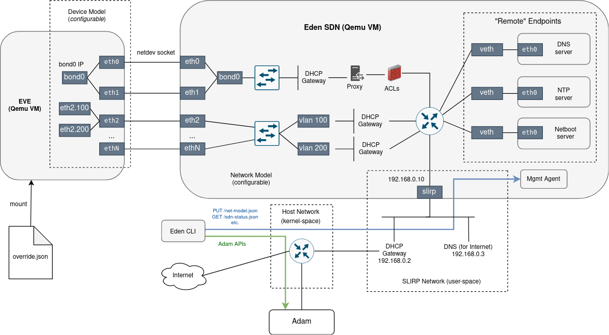

# Evetest-SDN

## Software-Defined Networking

The idea behind **Evetest-SDN** is to make the networking deployed by evetest fully **programmable**
and also more **isolated** from the host (device/VM provider), allowing to exercise a much wider
range of network-oriented tests and experiments (without tampering with the host network).

Following the principles of the *Software-Defined Networking* (SDN for short), a desired state of the
network (interface count, topology, IP settings, firewall rules, etc.) is described declaratively and
applied into the network stack programmatically using a [management agent](./cmd/sdnagent).

We refer to this desired network state as "Network model". This is in resemblance to EVE terminology,
where "Device Model" is used to describe device hardware, including network adapters. In fact, Network
model affects Device model - for example it determines the number of ethernet interfaces a device
is going to have.

The network model is defined using Go language [here](./api/netModel.go). User prepares the content
of a network model as a JSON file and the same format is also used for transportation between
Evetest and the SDN management agent.

## Components

Evetest-SDN is a component of the evetest infrastructure, running as an additional light-weight VM.

TODO: this is outdated:
```
The VM is built inside the eve repository using linuxkit CLI during the `eden setup` stage.
It is deployed by `eden start` just before EVE VM. In terms of supported virtualization technologies,
the focus is on the Qemu/KVM variant. Others (Vbox, Parallels) are unsupported by the SDN for now.
With Qemu, the socket networking backend is used to create ethernet connections between EVE and SDN VMs.
```

The SDN VM runs a management agent, written in Go (see [here](./cmd/sdnagent)).
The main challenge for this agent is the reconciliation between the desired state (network model)
and the actual state of the (Linux) network stack. There is already a tool for this task inside
the EVE-libs repository: [State Reconciler](https://github.com/lf-edge/eve-libs/tree/main/reconciler).

Evetest-SDN depends on Linux network stack and the tools that it provides to build a desired network
topology (network namespaces, VETHs, Linux bridge, VLAN sub-interfaces, iptables, etc.). Additionally,
it uses [dnsmasq](https://thekelleys.org.uk/dnsmasq/doc.html) as a DNS and DHCP server,
and [goproxy library](https://github.com/elazarl/goproxy) to build a MITM or an explicit HTTP/HTTPS proxy.

By encapsulating all these aspects of networking into a VM, we get better isolation from the host.
TODO: this is outdated:
```
However, adam controller still continues running as a container on the host inside the docker network.
And, of course, traffic headed toward the Internet also crosses the host network.
```

The agent runs an HTTP server and expose RESTful endpoints to apply/get network model, get status and more.
TODO: this is outdated:
```
These endpoints are used by evetest using a client implemented by package [edensdn](../pkg/edensdn).
```

Diagram below shows an integration of the Evetest-SDN VM with the rest of the evetest infrastructure.
Note that the network topology displayed is only an example. In practise, it can be anything that
can be modeled by the network model.

TODO: this picture needs update for evetest


TODO: describe Building, Configuration, Evetest CLI commands for interacting with SDN
