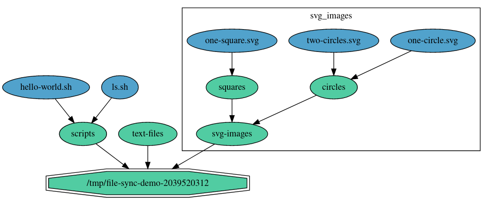

# Dependency Graph (depgraph)

## Use-case

This package implements a [dependency graph](https://en.wikipedia.org/wiki/Dependency_graph).
The main use-case is to represent configuration items (network interfaces, routes,
volumes, etc.) or any managed stateful objects (incl. processes, containers, files, etc.)
as graph nodes and their dependencies as directed graph edges.
Graph assumes that state transitions for these objects are done with the CRUD
semantics, using methods Create, Modify and Delete.

For example, if there are nodes for objects A and B with edge (dependency) A->B,
it means that B should be created before A. Conversely, the removal of these
two items should proceed in the opposite order, i.e. A should be removed first
(think of the dependency as "A cannot exist without B"). Edges of this dependency
graph slightly diverge from the standard definition as it is allowed for an edge
to point to a node which is not present in the graph, representing a scenario
of a missing dependency.

The graph can be for example used to model the intended or the current state
of a managed system. Note that depgraph alone only provides a data structure
to store the modeled state. However, in combination with the [Reconciler](../reconciler/README.md),
it can help to solve the challenge of state reconciliation. A management
agent will typically maintain two graphs, one for the intended state, updated
based on the input from a user/controller, and the other for the current state.
The agent will use APIs of the managed system to learn the actual state
and will update the graph accordingly. The reconciler will take both of these
graphs as an input and will perform all state transitions needed to get
reach the intended state, updating the graph representing the current state
in the process. For more information on the topic of state reconciliation,
please refer to the [readme file of the Reconciler](../reconciler/README.md).

## Subgraphs

Apart from nodes and edges, the graph also supports a notion of subgraphs.
A subgraph is a subset of graph nodes, including all edges that originate or point
from/to any of these nodes (again, a slight deviation from the standard definition).
Subgraph is given a name and optionally also a description (just like the top-level
graph). The main use-case is to group related items and allow to select and edit
them together.

For example, all components of a virtualized network (bridge, routes, dns server, etc.)
can be grouped into one subgroup with the logical name of the network.
Then, to add or replace all the components of the network in the graph, only one function
call is needed:

```go
virtNetwork := depgraph.New(depgraph.InitArgs{Name: virtNetworkName, ...})
graph.PutSubGraph(virtNetwork)
```

Also, the entire content of the subgraph can be removed with just:

```go
graph.DelSubGraph(virtNetworkName)
```

Subgraphs can be also nested and thus compose a hierarchical tree structure.
This is very similar to directory structure of a filesystem if you think of subgraphs
as directories and nodes as files.
Currently, subgraphs are not related to and does not affect dependencies.

Note that in terms of API, subgraph is also a graph - it implements the `Graph`
interface. Single node can also be viewed as a subgraph and therefore it implements
`Node.AsGraph() GraphR` method, returning a (read-only) graph handle.

## API & Usage

Configuration items modeled by the graph nodes should implement the `Item` interface.
This means that for every distinct item type, there needs to be a structure
with methods as required by the interface. For example, it is required to provide
a name for an item instance (based on the item configuration) through the method
`Name() string`. Two distinct items of the same type should have different names.
Distinct here means that the manifestation of these items are two separate objects
in the managed system. A graph-wide unique item identifier is therefore a combination
of the type (returned by `Type() string`) and the name. Every distinct item is modeled
by the graph as a separate node (`Node` struct).
Another notable method defined by the `Item` interface is `Dependencies`. It lists
all the dependencies of the item and therefore determines the outgoing edges of the
node representing the item.

Here is a simplified example for Items representing Linux interfaces and routes.
Only `Name()`, `Type()` and `Dependencies()` methods are shown here. For other
required methods, please see the `Item` interface definition.

```go
import "github.com/lf-edge/eve/libs/depgraph"

type LinuxInterface struct {
    name string
}

func (intf LinuxInterface) Name() string {
    return intf.name
}

func (intf LinuxInterface) Type() string {
    return "Linux interface"
}

func (intf LinuxInterface) Dependencies() []depgraph.Dependency {
    // no dependencies
    return []depgraph.Dependency{}
}

// Other Item methods for LinuxInterface are omitted.

type LinuxRoute struct {
    via    string
    dst    string
    metric int
}

func (route LinuxRoute) Name() string {
    // Both dst and via should be included to uniquely identify the route
    // among all the routes.
    return route.dst + " via " + route.via
}

func (route LinuxRoute) Type() string {
    return "Linux route"
}

func (route LinuxRoute) Dependencies() []depgraph.Dependency {
    return []depgraph.Dependency{
        {
            Item: depgraph.RequiredItem{
                Type: "Linux interface", // can also use LinuxInterface{}.Type()
                Name: route.via, // can also use LinuxInterface{name: route.via}.Name()
            },
            Description: "Route requires outgoing interface to be configured first",
        },
    }
}

// Other Item methods for LinuxRoute are omitted.
```

Once all needed `Item` implementations are available, one is ready to build a dependency
graph to model some kind of system state.
Graph with some initial content is created using `NewDepGraph`:

```go
import "github.com/lf-edge/eve/libs/depgraph"

// using LinuxRoute and LinuxInterface defined above

g := depgraph.New(depgraph.InitArgs{
    Name:        "MyGraph",
    Description: "This is my example graph",
    Items:       []Item{
        LinuxRoute{via: "eth0", dst: "10.10.0.0/16", metric: 10},
        LinuxRoute{via: "eth0", dst: "192.168.16.0/24", metric: 10},
        LinuxInterface{name: "eth0"},
    },
})
```

Graph will automatically create one node for each item and will build edges based on
dependencies of these items. In the example above, there will be edge from both routes
pointing to the `eth0` interface.
`InitArgs` can also contain the initial content of subgraphs.

A single Node is manipulated using `Node()`, `PutNode()` and `DelNode()` methods:

```go
import (
    "fmt"
    "github.com/lf-edge/eve/libs/depgraph"
)

// Add new Linux route.
// Note that `PutNode()` takes `Node` pointer so that a reference to the graph can be
// added into the Node (this is needed for `Node.AsGraph()`).
n := depgraph.Node{Item: LinuxRoute{via: "eth0", dst: "10.20.0.0/16", metric: 100}}
g.PutNode(&n)

// Update the node.
n.metric = 50
g.PutNode(&n)

// Delete the node.
g.DelNode(n.ID())

// Read graph node.
n, found := g.Node(depgraph.NodeIDForItem(LinuxInterface{name: "eth0"}))
if found {
    fmt.Printf("Linux interface graph node: %+v\n", n)
}
```

Note that Node is not only a container for Item, but is able to store some additional
information which may be useful for state reconciliation purposes.

To iterate all nodes in the graph:

```go
inclSubGraphs := true
iter := g.Nodes(inclSubGraphs)
for iter.Next() {
    n := iter.Node()
    fmt.Printf("Graph node: %+v\n", n)
}
```

To iterate all edges originating from a node:

```go
iter := g.OutgoingEdges(n.ID())
for iter.Next() {
    e := iter.Edge()
    fmt.Printf("Edge from %s to %s for dep: %+v\n",
        e.FromNode, e.ToNode, e.Dependency)
}
```

Lastly, sub-graphs are manipulated using `SubGraph()`, `PutSubGraph()`, `DelSubGraph`
and `EditSubGraph` methods:

```go
item1 := LinuxInterface{name: "eth0.1"}
item2 := LinuxInterface{name: "eth0.2"}
subG := depgraph.New(depgraph.InitArgs{
    Name:        "MySubGraph",
    Description: "This is my example sub-graph",
    Items:       []Item{item1, item2},
})

// Add new subgraph
g.PutSubGraph(subG)

// Can use the same handle to edit the subgraph...
subG.DelNode(depgraph.NodeIDForItem(item1))

// ... or a read-write handle can be retrieved:
readSubG := g.SubGraph("MySubGraph")
subG = g.EditSubGraph(readSubG) // elevate to read-write
subG.PutNode(&Node{Item: item1})

// Get read-only subgraph handle:
readSubG := g.SubGraph("MySubGraph")
// can only read nodes, edges, etc.

// Remove the subgraph:
g.DelSubGraph("MySubGraph")
```

## Visualization

The graph content can be exported into [DOT](https://en.wikipedia.org/wiki/DOT_(graph_description_language))
using `DotExporter` and then visualized for example using [Graphviz](https://graphviz.org/).
Subgraphs are drawn as [clusters](https://graphviz.org/Gallery/directed/cluster.html),
i.e. items they contain are plotted near each other and contained within a rectangle.

Example usage (incl. Graphviz from Go):

```go
// import "github.com/goccy/go-graphviz"

// Render DOT representation of the dependency graph.
dot, err := graph.RenderDOT()
if err != nil {
    log.Fatalf("depgraph DOT rendering failed: %v", err)
}

// Use go-graphviz - a Graphviz wrapper for Go.
gvizGraph, err := graphviz.ParseBytes([]byte(dot))
if err != nil {
    log.Fatalf("failed to parse DOT: %v", err)
}
gviz := graphviz.New()
err = gviz.RenderFilename(gvizGraph, graphviz.PNG, "/path/to/graph.png")
if err != nil {
    log.Fatal(err)
}
```

Example of a rendered depgraph:


