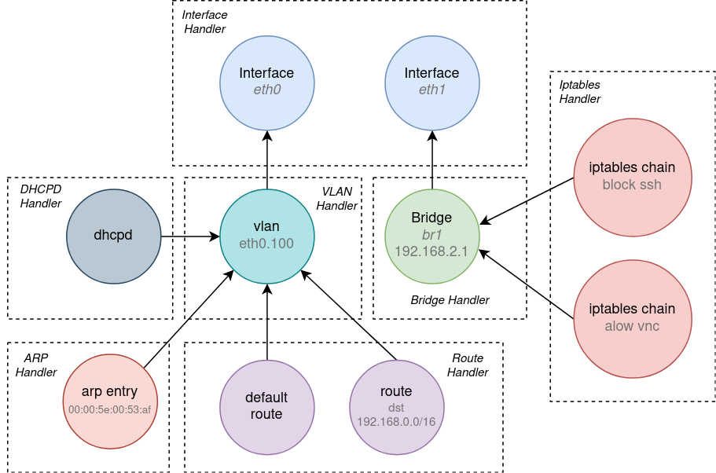

Dependency Graph (depgraph)
===========================

Motivation
----------

Configuration management agents (like EVE's microservices) typically receive a declarative
description of the intended (also called desired) state to apply into the managed system.
This description is usually at a higher level of abstraction and expresses the intent,
not the implementation. The agent then *renders* a corresponding set of low-level run-time
objects (e.g. processes to run, files to write, config primitives to create), that, once
*applied* into the running system, will implement the requested intent. The process of
updating the system state is not trivial, however. The agent first have to compare the new
intended state with the actual (also known as the current) state of the system. Based on
the difference, the agent determines the sequence of operations to execute in order to
synchronize the system state with the new intent. The order of operations often matters
as it has to respect all dependencies that exist between configured objects. Operations
are usually described using the CRUD interface (Create, Update/Modify, Read and Delete),
but a different semantic for state manipulation is also possible.

To summarize, the problem described above can be split into the following tasks:

  1. From high-level declarative description (received from a user/controller) render
     the corresponding set of configuration primitives, processes or files to create/run/write
     in the running system.
  2. Determine the difference between the current system state and the new (rendered)
     intended state.
  3. Determine the set of (Create/Modify/Delete) operations to execute and find a valid ordering.
  4. Execute operations, collect any errors and report back to the user/controller.

While the task no. 1 is specific to each management agent, tasks 2. and 3. (and to some degree
also 4.) can be tackled in a generic way and in one place using a [dependency graph](https://en.wikipedia.org/wiki/Dependency_graph),
implemented by this package.

Features
--------

Depgraph implements a dependency graph solving the problem of the current ↔ intended state
reconciliation as described above. Every configuration primitive (OS config, file, process, etc.),
further denoted as *configuration item* or just *item*, can be represented by a single graph node.
In the graph's API, this is described by the Item interface (see [depgraph_api.go](./depgraph_api.go))
Dependencies between items are modeled using directed edges. For the start, the graph supports
dependency with the semantics *"must exist"*. To give an example from networking: if a route depends
on a particular network interface to be configured first, there will be an edge originating at the
route's graph node and pointing to the node of the network interface. A visual example with a dependency
graph representing network configuration is shown below:



Depgraph is able to:

* Store the currently running state
* Allow to prepare a new intended state (on the side)
* Update the current state to correspond with the new intended state - this means to:
    1. Determine "diff" between the current and the new state
    2. Find ordering of Create/Modify/Delete operations that respects the dependencies
    3. Execute operations
    4. Store and expose any errors returned by Create/Modify/Delete operations

For the graph to be able to execute planned operations, it needs to have access to handlers/drivers
of configuration items. In the graph's API, this is described by the Configurator interface
(see [depgraph_api.go](./depgraph_api.go)). For every class of configuration item instances
(given by Item.Type(); e.g. "Linux route", "docker container", "dnsmasq process"), there
should be a separate Configurator registered with the graph. For the graph, these Configurators
are essentially backends or drivers, that the graph calls as needed to synchronize the current
state with the latest desired state.

However, configuration items that an agent manages might depend on unmanaged system properties
(notifications) or on items configured by other agents running on the same system. These can be
represented using so-called *external* items (see Item.External()). For these items, the graph
does not expect to have Configurators available. Putting/removing them to/from the graph is
used only to announce their presence (or lack of it) and their state, which is then used only
to resolve the state of dependencies of non-external items.

To allow building and changing the intended state, the graph provides Put/Del operations via
the `Selector` interface. To make this process easier, depgraph introduces a concept of item
clustering (partly borrowed from [Graphviz](https://graphviz.org/Gallery/directed/cluster.html)).
Clusters are used to group related items and to allow selecting and editing them together.
For example, all components of a managed network (bridge, routes, ACLs, etc.) could be grouped
into one cluster labeled with some logical name of the network. Then, if the network is
removed by the user/controller, the intended state can be updated as easily as:

```text
graph.Cluster(<network-name>).Del()
```

Also, the entire content of a cluster can be replaced with:

```text
graph.Cluster(<name>).Put(<new-content>)
```

DepGraph will run a "diff" algorithm to automatically determine which items should
be created/modified/deleted. Clusters can be also nested and thus compose a hierarchical
tree structure. This is very similar to directory structure of a filesystem if you think
of clusters as directories and items as files. The top-level cluster has empty name and
represents the graph as a whole. Currently, clustering is not related to and does not
affect dependencies.

The current state stored by the graph can be obtained through the graph API (see `ItemSummary`
and `ClusterSummary`). Also, the graph as a whole can exported to [DOT language](https://graphviz.org/doc/info/lang.html)
and visualized using [Graphviz](https://graphviz.org/) for troubleshooting/presentation
purposes. Example of a rendered depgraph:


Usage
-----

To initialize and start using an instance of the dependency graph is very simple.
Caller may provide a logger (but it is optional):

```go
log := MyLogger{}
graph := depgraph.NewDepGraph(log)
```

Next, configurators for all (non-external) items that will be manipulated through
the graph should be registered with depgraph. For example:

```go
err := g.RegisterConfigurator(LinuxInterfaceConfigurator{}, "linux-interface")
if err != nil {
    log.Errorf("Failed to register configurator for Linux interfaces: %v", err)
    os.Exit(1)
}
err := g.RegisterConfigurator(LinuxRouteConfigurator{}, "linux-route")
if err != nil {
    log.Errorf("Failed to register configurator for Linux routes: %v", err)
    os.Exit(1)
}
...
```

Now in order to build the intended state, use `Put()`/`Del()` operations accessible
via the `Selector` interface. For example:

```go
myNetwork := depgraph.Cluster{
    Name:        "My network",
    Description: "Network managed by an agent.",
    Items:       []depgraph.Item{
        linuxBridge{name: "bd0", uplink: "eth0"},
        linuxRoute{dst: "192.168.1.0/24", gw: "192.168.1.1"},
        linuxInterface{name: "eth0"},   // Could be and external item
    },
}

graph.Cluster(myNetwork.Name).Put(myNetwork)
```

Once the intended state is updated, trigger reconciliation between the intended
and the actual state:

```go
err := g.Sync(ctx)
if err != nil {
    log.Errorf("depgraph sync failed: %v", err)
}
```

To obtain the state information for items/clusters, use `Get()` method accessible
via the `Selector` interface. For example:

```go
summary, err := g.Cluster(myNetwork.Name).Get()
if err != nil {
    log.Errorf("failed to obtain state information from depgraph: %v", err)
} else {
    log.Infof("State of the cluster and of the items inside it: %+v", summary)
}
```

Finally, to visualize the graph content, which can be useful for troubleshooting
or presentation purposes, render the graph to the DOT language and use graphviz
to render an image:

```go
// import "github.com/goccy/go-graphviz"

// Render DOT representation of the dependency graph.
dot, err := graph.RenderDOT()
if err != nil {
    log.Fatalf("depgraph DOT rendering failed: %v", err)
}

// Use go-graphviz - a Graphviz wrapper for Go.
gvizGraph, err := graphviz.ParseBytes([]byte(dot))
if err != nil {
    log.Fatalf("failed to parse DOT: %v", err)
}
gviz := graphviz.New()
err = gviz.RenderFilename(gvizGraph, graphviz.PNG, "/path/to/graph.png")
if err != nil {
  log.Fatal(err)
}
```

A simple demonstration of the depgraph usage, as used to synchronize a file-system
directory content to match the expectation, can be found [here](examples/filesync/README.md).

Additional Benefits
-------------------

Dependency graph not only allows to solve a common problem in one place, therefore
shortening the code size and the complexity of management agents, but it also enforces
a much more readable, sustainable and extensible programming style. Consider the following
(networking) example comparing a usual, overly imperative programming style and how it changes
when depgraph is introduced:

* Usual imperative programming:

```text
whenNetworkConfigChanges(<high-level network config>) {
    determineObsoleteVlans()
    removeObsoleteVlans()
    determineObsoleteBonds()
    removeObsoleteBonds()
    changeInterfaceIPsIfNeeded()
    ifSomethingChangedRestartDnsmasq()
    addNewBonds()
    addNewVlans()
    ...
}
```

* Declarative programming with depgraph:

```text
whenNetworkConfigChanges(<high-level network config>) {
    newConfig := []ConfigItem{
        interface(params),
        arpEntry(params),
        arpEntry(params),
        route(params),
        route(params),
        bridge(params),
        dnsmasq(params),
        // A comment explaining why this config item is here…
        iptablesChain(params),
        iptablesChain(params),
        ...
    }
    graph.Cluster(<network-name>).Put(newConfig)
    err := graph.Sync()
    ...
}
```

Note that the new approach is not only easier for the developer and therefore less
bug-prone, but also allows to explicitly express the intent (= `newConfig`), while
the steps (the sequence of configuration changes) needed to take to get there are
implicit. Compare that with the "usual" approach, where the steps are explicit,
but the programmer's intent is implicit. To determine what the program is trying
to configure, one must study the code thoroughly and build a mental image of the
intended state. If the programmer made a mistake in that complex code, one might
get a wrong idea of what the intended state is.

Lastly, with the dependency graph, it is much easier to add new features.
For the most part, a programmer only needs to implement handlers for new configuration
items and describe their dependencies. The rest is being taken care of by the graph.

Limitations and Future Plans
----------------------------

1. Currently, the synchronization procedure executes Create/Modify/Delete operations
   sequentially and from a single Go routine. This may be a limiting factor if changing
   the state of an item requires to perform a long-running task, such as downloading
   a large file from the Internet.
   A support for *asynchronous operation execution* is already planned for the near future,
   however. Configurator will have an option (probably by use of the context argument)
   to continue running operation inside a separate Go routine, exiting back to depgraph
   immediately and informing that the state change continues in the background.
   Once the operation finalizes, a channel will be available to signal the completeness
   together with the error value back to depgraph. Item for which an asynchronous
   operation is ongoing will be marked in the graph with a new state `ItemStateInProgress`.
   Only after the background task finalizes, will depgraph continue applying other item
   changes that depend on it. In other words, items that do not depend on each other
   (directly or transitively) will be allowed to change their states in parallel.
   And if there are any restrictions for parallel execution besides item dependencies,
   synchronization primitives like mutexes are always an option.
2. Currently, depgraph assumes that the actual state is the same as the intended state
   of the last `Sync()` - but this could be a wrong assumption if some operations failed
   or if the state changed somehow due to external factors (e.g. a reboot/crash of a managed
   process). Instead, Configurators could be extended with Read operations (i.e. provide
   complete CRUD), and depgraph could implement a *full reconciliation* between the actual
   state (as determined using the Read operations) and the intended state (similar to what
   Controllers in Kubernetes do). Additionally, depgraph could automatically retry or revert
   failed operations.
