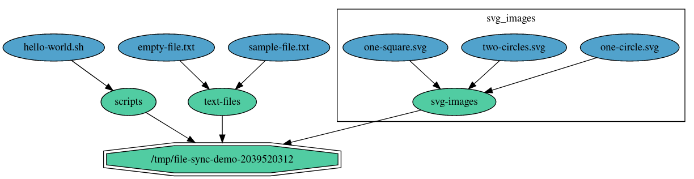
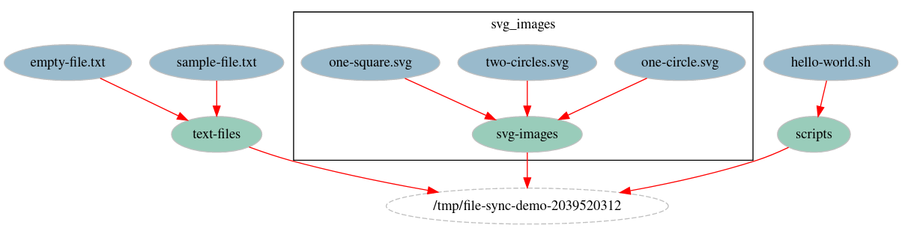

Depgraph Demonstration: File-Sync
=================================

Directory Synchronization Problem
---------------------------------

This is a simple demonstration of the depgraph usage. The API and the semantics
of the dependency graph is generic enough to be applied for any problem where the
intended state of a system can be represented by a set of objects that can be
Created/Modified/Deleted and that may have some dependencies between them.
In this example we use depgraph to handle the problem of (a local) file-system
directory content synchronization, something like what rsync does minus the networking.

The intended state in this case is a set of files and sub-directories, with their
contents, paths and access rights, that we want to have created inside a specific
file-system directory (let's denote it as "root" for our case). If the root directory
is empty, the files and directories should be created from outwards to inwards.
File/directory cannot be created if the parent directory doesn't exist yet. Removal,
on the other hand, should be performed in the opposite direction, starting with the
bottom level of the directory tree and continue up. Modifications, combining create,
delete but also file move operations, is where things really start to get complicated.
It is always possible to first clear the content of the synchronized directory and
re-create the new intended state from the scratch, but this is a very inefficient
solution.

A better solution is to leverage depgraph. Files and directories can be represented
as graph nodes, and the dependencies on parent directories as edges. This is exactly
demonstrated in this simple program. For example, Create operation for a file is
implemented as `ioutil.WriteFile()`, Modify can change the access right with `os.Chmod`
and move the file `os.Rename` and Delete is based on `os.Remove` (see `file.go`).
Configurator for directories is completely based on the `os` package (see `directory.go`).
The crux of the problem, which is to determine the right (and efficient) sequence
of operations to execute to get the directory content in-sync with the intention,
is left for the depgraph to handle.

Scenario
--------

The root directory for this example is created as a temporary directory under `/tmp`
to not pollute the user's filesystem content.

For the initial state, we ask depgraph to create some directories with SVG images,
scripts and text files. Graph representation (as rendered by depgraph + graphviz)
of this state is shown below:

The first synchronization consists of Create operations only.
Next, however, we ask for several changes to the intended state, which requires
to remove some file/directories, create new ones and even to move some of the existing
files. Depgraph is able to find optimal sequence of operations in this case.
Graph representation of this new state is shown below:

Finally, we inform depgraph about a planned removal of the root directory. Since
all the contained files and subdirectories depend on it either directly or transitively,
depgraph will delete all the objects from bottom-up.

