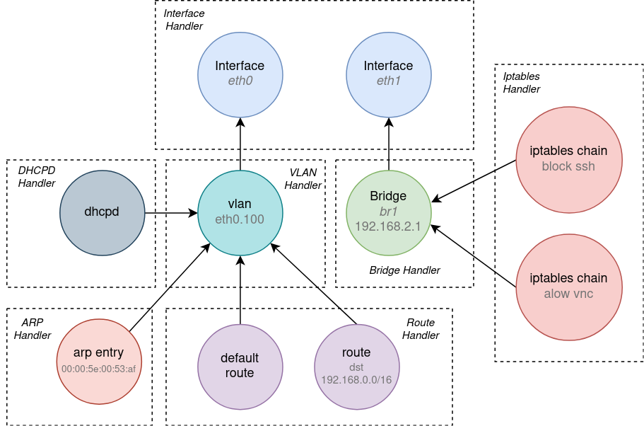

# State Reconciler

## Problem Statement

Configuration management agents typically receive a declarative description
of the intended (also called desired) state to apply into the managed system.
This description is usually at a higher level of abstraction and expresses
the intent, not the implementation. The agent then *renders* a corresponding
set of low-level run-time stateful objects (e.g. processes to run, files to write,
config primitives to create), that, once *applied* into the running system,
will implement the requested intent. The process of updating the system state is
not trivial, however. The agent first have to compare the new intended state with
the actual (also known as the current) state of the system. Based on the difference,
the agent determines the sequence of operations (state transitions) to execute,
in order to synchronize the system state with the new intent. The order of operations
often matters as it has to respect all dependencies that exist between configured objects.
Operations are usually described using the CRUD interface (Create, Update/Modify, Read
and Delete), but a different semantic for state manipulation is also possible.

To summarize, the problem described above can be split into the following tasks:

  1. From a high-level declarative description (received from a user/controller),
     render the corresponding set of configuration primitives, processes or files
     to create/run/write in the running system.
  2. Determine the difference between the current system state and the new (rendered)
     intended state.
  3. Determine the set of (Create/Modify/Delete) operations to execute and find a valid
     ordering.
  4. Execute operations, collect any errors and report back to the user/controller.

While the task no. 1 is specific to each management agent, tasks 2, 3 and to some
extent also 4 can be tackled in a generic way and in one place using **Reconciler**
provided by this package.

## Solution

Reconciler is able to determine, properly order and drive state transitions needed
to execute to reach the intended state. It requires that the current state as well as
the intended state are each modeled as a separate instance of a [dependency graph](https://en.wikipedia.org/wiki/Dependency_graph),
provided by the [depgraph package](../depgraph/README.md).
The idea behind using a dependency graph for state representation is described in detail
in the depgraph package. To summarize: every configuration primitive (OS config, file,
process, etc.), further denoted as *configuration item* or just *item*, can be represented
by a single graph node, while dependencies between items are modeled using directed edges.
The graph supports dependency with a semantics *"must exist"*.\
To give an example from networking: if a route depends on a particular network interface
to be configured first, there will be an edge originating at the route's graph node and
pointing to the node of the network interface.\
A visual example with a dependency graph representing network configuration is shown below:



Reconciler exposes a single method `Reconcile()`, expecting read-write access to a graph
modeling the current state and read-only access to a graph modeling the intended
destination state.\
Reconciler then proceeds with the following sequence of procedures:

  1. Determine "diff" between the current and the intended state.
  2. Find ordering of Create/Modify/Delete operations that respects the dependencies.
  3. Execute operations (async operations may continue in background).
  4. Return reconciliation status.

Reconciler itself is stateless. It is up to the management agent to maintain
(or always rebuild from scratch) dependency graphs with the current and the intended
state. All state changes performed during `Reconcile()` are reflected into the graph with
the current state by Reconciler. The updated or created (if input was nil) current state
graph is returned inside the reconciliation status. The management agent may decide
to either keep the current state graph instance for the next reconciliation, or to re-read
the state of the managed system (if necessary API is available) and rebuild the graph.
The latter approach could be very costly but potentially more robust. It is recommended
to rebuild (entire or a subset of) the current state at least when some state transitions
have failed (`reconciler.State.Err != nil`) and therefore it is uncertain if the intended
state was reached. On the other hand, the intended state does not change with state
transitions and therefore it is passed to `Reconcile()` as read-only. It should be updated
by the management agent whenever the configuration coming from a controller/user changes.

For the Reconciler to be able to perform state transitions, it needs to have access
to so-called [Configurators](./configurator.go), which are essentially handlers/drivers
of configuration items, providing methods `Create()`, `Delete()` and `Modify()`. The mapping
between an item and a corresponding Configurator is built using a [ConfiguratorRegistry](./configurator.go).
[DefaultRegistry](./configurator.go) allows to have a single Configurator registered for
every [item type](../depgraph/depgraph_api.go).\
However, configuration items might depend on unmanaged system properties or on items
configured by other agents running on the same system. These can be represented using
so-called *external* items (see [Item.External()](../depgraph/depgraph_api.go)).
For these items, the graph does not expect to have Configurators available. They are
also not expected (but not disallowed) to appear in the graph with the intended state.
However, they are put/deleted to/from the graph with the current state (by a management agent)
to announce their presence (or lack of it) and their state, which is then used only to resolve
the status of dependencies of non-external items.

## Usage

First things first, to model the current/intended state and to perform state transitions,
you need to prepare implementations of the `Item` and the `Configurator` interfaces for every
involved item. How the `Item` should be implemented is explained in the [Readme file
for the depgraph package](../depgraph/README.md).

### Configurator

The `Configurator` is essentially a handler for selected items, allowing Reconciler
to perform state transitions as needed using `Create()`, `Modify()` and `Delete()`
operations. However, what exactly happens inside these methods is completely irrelevant
to the Reconciler. `Create()` receives the intended state of an item, `Delete()`
the current state and `Modify()` both. Configurator will need to type-cast the interface
to the corresponding concrete type to read the state.\
For [example](examples/filesync/README.md):

```go
// Directory implements Item (methods are omitted from the example)
type Directory struct {...}

// DirConfigurator implement Configurator for Directory
// (only the Create method is shown below).
type DirConfigurator struct {...}

// Create creates a new directory.
func (dc DirConfigurator) Create(ctx context.Context, item depgraph.Item) error {
    // Cast Item to Directory (to read attr ".Permissions" in this case),
    // which is what this Configurator is a handler for.
    d := item.(Directory)
    return os.Mkdir(d.Name(), d.Permissions)
}
```

Sometimes, to modify an item from the current state to a new intended (but not deleted)
state, it is necessary to completely recreate the item. This may be for example
due to the fact that there is no API in the managed system available to perform modification
in-place. In this case the Reconciler *needs* to know that the item is going to be recreated.
This is because it has to first *temporarily* delete all the other items that depend on it
and recreate them afterwards. Otherwise, the dependencies would not be respected.
For this purpose, the `Configurator` interface defines method `NeedsRecreate()`.
It will be called by the Reconciler before each `Modify`. If `NeedsRecreate()` returns
`true`, the Reconciler will perform `Delete()` + `Create()` instead of `Modify()`,
and it will also perform any additional operations as required by dependencies.

If changing the state of an item requires to perform a long-running task, such as to download
a large file from the Internet or to unpack a sizeable archive, it is recommended to continue
this work in the background in a separate Go routine, in order to not block other *independent*
state transitions. This is possible by use of the `ContinueInBackground()` method, applied
on the context attribute, which `Create()/Delete()/Modify()` receive from the Reconciler.
The function returns a callback `done(error)`, which the spawned Go routine should call
once the operation has finalized. A long-running operation should also monitor the `ctx.Done()`
channel and stop as soon as possible when it is closed.\
Example usage:

```go
func longRunningTask(ctx context.Context) error {
    ticker := time.NewTicker(interval * time.Millisecond)
    for {
        select {
        case <-ticker.C:
            finalized, err := doSomething()
            if err != nil {
               return err
            }
            if finalized {
               break
            }
        case <-ctx.Done():
            return errors.New("failed to complete")
        }
    }
    return nil
}

func (c *MyConfigurator) Create(ctx context.Context, item depgraph.Item) error {
     done := reconciler.ContinueInBackground(ctx)
     go func() {
          err := longRunningTask(ctx)
          done(err)
     }
     // Exit immediately with nil error.
     return nil
}
```

Note that Reconciler ensures that two items might change their state in parallel
only if there are no dependencies between them, either direct or transitive.
And if there are any restrictions for parallel execution besides item dependencies,
synchronization primitives like mutexes are always an option.

### Configurator Registry

Reconciler uses an implementation of `ConfiguratorRegistry` to obtain `Configurator`
for an `Item` using the method `GetConfigurator()`. `DefaultRegistry` is the "default"
implementation and likely the registry of choice in most cases. It allows to map
one Configurator to every (non-external) item type. The registry is built using the method
`DefaultRegistry.Register()`. It should be called for every involved configurator
before the registry is passed to a Reconciler. It is recommended to prepare registry
once (during init maybe) and keep using it with every Reconciler instance.\
Example for `DefaultRegistry`:

```go
// Implements Item interface.
type LinuxRoute struct {
     via    string
     dst    string
     metric int
}

func (lr LinuxRoute) Type() string {
     return "Linux route"
}

// Other Item methods for LinuxRoute are omitted...

// Implements Configurator interface
type LinuxRouteConfigurator struct {}

func (lrc LinuxRouteConfigurator) Create(ctx context.Context, item depgraph.Item) error {
     route := item.(LinuxRoute)
     return netlink.RouteAdd(...)
}

// Other Configurator methods for LinuxRouteConfigurator are omitted...


type MyAgent struct {
    // Keep registry instead of rebuilding it for every reconciliation.
    registry reconciler.ConfiguratorRegistry
}

func (a MyAgent) init() {
    // Build a (default) registry of configurators.
    registry := &reconciler.DefaultRegistry{}
    registry.Register(LinuxRouteConfigurator{}, "Linux route")

    // Alternative approach to reference item type:
    // registry.Register(LinuxRouteConfigurator{}, LinuxRoute{}.Type())
}
```

### Reconciler

First, let's summarize all prerequisites for using the Reconciler:

  1. Prepare `Item` and `Configurator` implementations.
  2. Build a registry mapping Configurators to items (consider using `DefaultRegistry`).
  3. Prepare two depgraph instances - one to represent the current state and the other
     modeling the intended state. If the current state graph is `nil`, it means that
     there are no items currently created. If the intended state graph is `nil`, it means
     that all items inside the current state should be deleted.`Reconcile()` will return
     updated/created current state graph, but it will not change the intended state.\
     Note that by using subgraphs (see [Readme for depgraph](../depgraph/README.md)),
     it is possible to select only a "chunk" of the graph and run reconciliation only
     for that. If you know that only a subset of the state needs to be updated, use subgraph
     to decrease the size of the input and thus make the reconciliation less expensive.
     It is even possible to select only a single node for reconciliation.

A great thing about the Reconciler is that it is completely stateless, you can throw
it out after `Reconcile()` returns. For every reconciliation you can create a new
instance using `reconciler.New()`, it costs practically nothing. And even if there are
some async operations running in the background, you can resume the reconciliation with
a new instance of Reconciler. Any in-progress state information is kept inside the graph
representing the current state.

Using Reconciler for items with only synchronous state transitions is trivial:

```go
// Registry should only be created once (during some init procedure).
registry := &reconciler.DefaultRegistry{}
// ...

// Running reconciliation when needed with a new instance of Reconciler:
//  - ctx is of type context.Context
//  - currentState is of type depgraph.Graph
//  - intendedState is of type depgraph.GraphR (subset of depgraph.Graph methods)
// See libs/depgraph/README.md to learn how to build and update a graph.
r := reconciler.New(registry)
status := r.Reconcile(ctx, currentState, intendedState)
if status.Err != nil {
     fmt.Printf("State reconciliation failed: %v\n", status.Err)
}
fmt.Printf("Executed state transitions:\n%s\n", status.OperationLog)

// currentState was updated by Reconciler in-place (no need to take from status.NewCurrentState).
// However, if currentState was nil, Reconciler created a new graph instance.
currentState = status.NewCurrentState
```

With asynchronous operations the usage is still relatively simple.\
Let's assume that a management agent is built around a single main event loop,
consisting of an infinite `for` loop and a `select` statement waiting for events.
Some of these events may result in a change for the intended state and therefore
require to run a state reconciliation.

Reconciler always only waits for synchronous operations and exists immediately when all
of them finalize. This is the case even when it encounters some asynchronous operations.
It simply marks the item as being in-progress of a state transition, and continues with
other items that do not depend on it but also require update. This means that when Reconciler
exits, some operations may still be running, as signaled by `reconciler.Status.AsyncOpsInProgress`.
The caller should use the channel `reconciler.Status.ReadyToResume` to watch for a signal
to resume reconciliation. Note that this is implemented without reconciler running any Go
routine to monitor background operations. It is designed to be completely stateless and
can be thrown out after `Reconcile()` even if `AsyncOpsInProgress` is returned as true.
Once `ReadyToResume` fires, the caller can just create a new instance of the Reconciler
to continue with the reconciliation.

While some long-running asynchronous state transitions are running in the background,
the intended state may change. It is completely acceptable to run resumed (or simply
next) reconciliation against a different intended state. However, if `AsyncOpsInProgress`
is returned as true, the current state graph (`reconciler.status.NewCurrentState`) should be
preserved and used as the input for the next reconciliation instead of being re-build,
to resume asynchronous state transitions properly.

A complete example of a management agent based on the Reconciler, supporting asynchronous
state transitions is shown below. Note that neither Reconciler nor depgraph are thread-safe
and therefore should be accessed only from one Go routine. In the example below, the state
reconciliation is always performed from within the main loop of the agent.

```go
type MyAgent struct {
     currentState   depgraph.Graph
     intendedState  depgraph.Graph
     registry       reconciler.ConfiguratorRegistry

     // To manage asynchronous operations.
     resumeReconciliation <-chan struct{}     // nil if no async ops
     cancelAsyncOps       context.CancelFunc  // nil if no async ops
     waitForAsyncOps      sync.WaitGroup      // .Wait() is NOOP if no async ops
}

func (a *MyAgent) main() {
     for {
          select {
               case <- event1:
                    // change the intended state
                    a.intendedState.PutNode(...)

                    // Run state reconciliation.
                    // Can be triggered even if some asynchronous operations are
                    // still running and resumeReconciliation channel has not fired yet.
                    // Even the intended state can change while some operations
                    // haven't completed yet. Reconciler can deal with all of this.
                    // Moreover, using SubGraph() or Node.AsGraph() and EditSubGraph(),
                    // it is possible to reconcile just a subset of the graph.
                    r := reconciler.New(a.registry)
                    status := r.Reconcile(ctx, a.currentState, a.intendedState)
                    a.processReconcilerStatus(status)

               case <- event2:
                    // If you need to cancel all asynchronous operations, run:
                    if a.cancelAsyncOps != nil {
                         a.cancelAsyncOps()
                         a.waitForAsyncOps.Wait()
                         fmt.Println("Asynchronous operations were canceled!")
                    }

                // if the channel is nil, the case statement is ignored.
                // Note that the channel returns the name of the (sub)graph for which
                // the reconciliation may resume. This is useful if you are using
                // subgraphs to run "selective" reconciliation.
                case <- a.resumeReconciliation:
                    // No need to preserve Reconciler to resume async operations.
                    // All in-progress state is stored inside a.currentState
                    r := reconciler.New(a.registry)
                    status := r.Reconcile(ctx, a.currentState, a.intendedState)
                    a.processReconcilerStatus(status)

               // ...
          }
     }
}

func (a *MyAgent) processReconcilerStatus(status reconciler.Status) {
    a.currentState = status.NewCurrentState

    // Update variables needed to resume reconciliation.
    if status.AsyncOpsInProgress {
        fmt.Println("Some operations continue in the background!")
    }
    a.cancelAsyncOps = status.CancelAsyncOps
    a.resumeReconciliation = status.ReadyToResume
    a.waitForAsyncOps = status.WaitForAsyncOps
}
```

A simple runnable demonstration of the Reconciler + depgraph usage, as used to synchronize
a file-system directory content to match an expectation, can be found [here](examples/filesync/README.md).

## Additional Benefits

Reconciler not only allows to solve a common problem in one place, therefore shortening
the code size and the complexity of management agents, but it also enforces a much more
readable, sustainable and extensible programming style. Consider the following
(networking) example comparing a usual, overly imperative programming style and how it changes
when Reconciler is introduced:

* Usual imperative programming:

```go
whenNetworkConfigChanges(highLevelNetworkConfig) {
    determineObsoleteVlans()
    removeObsoleteVlans()
    determineObsoleteBonds()
    removeObsoleteBonds()
    changeInterfaceIPsIfNeeded()
    ifSomethingChangedRestartDnsmasq()
    addNewBonds()
    addNewVlans()
    ...
}
```

* Declarative programming with Reconciler:

```go
whenNetworkConfigChanges(highLevelNetworkConfig>) {
    newIntendedState := depgraph.New(depgraph.InitArgs{
        Name:        "Network config",
        Description: "Graph modeling network config",
        Items:       []Item{
            networkInterface(params),
            arpEntry(params),
            arpEntry(params),
            route(params),
            route(params),
            bridge(params),
            dnsmasq(params),
            // A comment explaining why this config item is here…
            iptablesChain(params),
            iptablesChain(params),
            ...
        },
    })

    r := reconciler.New(registry)
    status := r.Reconcile(ctx, currentState, newIntendedState)
    ...
}
```

Note that the new approach is not only easier for the developer and therefore less
bug-prone, but also allows to explicitly express the intent (= `newIntendedState`),
while the steps (the sequence of configuration changes) needed to take to get there
are implicit. Compare that with the "usual" approach, where the steps are explicit,
but the programmer's intent is implicit. To determine what the program is trying
to configure, one must study the code thoroughly and build a mental image of the
intended state. If the programmer made a mistake in that complex code, one might
get a wrong idea of what the intended state is.

Lastly, with the Reconciler and state modeled using a dependency graph, it is much
easier to add new features. For the most part, a programmer only needs to implement
new items and their configurators, the rest is being taken care of by the Reconciler.
