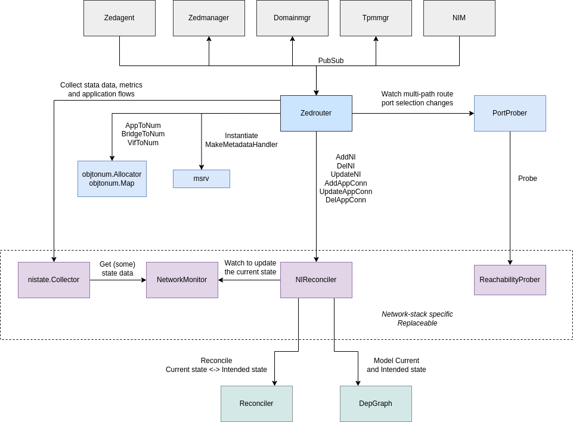

# Application Network Connectivity Management Agent in EVE (aka zedrouter)

## Overview

Zedrouter manages network connectivity for application instances.
It uses the underlying network stack and some open-source tools to provision virtual
networks, aka *network instances*, offering connectivity services for applications,
such as DHCP, DNS, NAT, ACL, flow monitoring, etc. It works in conjunction with the NIM
microservice to provide external connectivity for these network instances and applications
that connect to them. It also cooperates with domainmgr to attach applications
to select network instances using virtual interfaces, aka *VIFs*.

## Zedrouter Objects

### Network instances

TODO: very much obsolete, needs to be updated

Each network instance corresponds to one virtual switch which is by default
implemented using a Linux bridge (but alternative implementations using a different network
stack is possible).
If the network instance is of type switch that is basically it - simple packet forwarding
between applications and external network, without L3 termination in EVE (dom0).
For the other network instances (local, cloud, and mesh) there is also an instance
of dnsmasq which is deployed for the network instance to provide DHCP and DNS service,
including the ability to manage ip sets for DNS-name based firewall rules.

All network instances have firewall rules aka access control lists which are implemented
using iptables in such a way that we also get flow log information.

Local network instances which have a specified external port are provisioned with iptables
NAT rules for outbound connectivity plus any inbound connectivity specified in the firewall rules.

### VIFs

TODO: very much obsolete, needs to be updated

When an AppNetworkConfig specifies that an application instance should be attached
to a particular network instance then zedrouter will provision a unique MAC address
for that vif, provision dnsmasq with an IP address and a DNS hostname for the vif,
create the iptables rules based on the firewall rules including any ip sets,
and add the vif to the bridge.

## Key Input/Output

**Zedrouter consumes** (see `zedrouter.initSubscriptions()`):

* configuration for Network Instances
  * an instance of the `NetworkInstanceConfig` structure
  * published by `zedagent` microservice
  * it specifies the network instance type (local / switch / ...)
  * it references which port to use for external connectivity
    * it can reference specific port (e.g. `eth0`) or a group of ports (`uplink`, `freeuplink`)
      to fail-over between (load spreading not yet supported)
  * it contains IP configuration (subnet network address, gateway IP), etc.
  * it may contain DNS configuration (upstream DNS servers to use, static DNS entries, etc.)
* configuration for application connectivity
  * an instance of the `AppNetworkConfig` structure
  * published by `zedmanager` microservice
    * `zedmanager` orchestrates the process of application deployment and it must ensure
      that app image, app connectivity, volumes and the domain itself and created
      in the right order
  * contains a list of virtual interfaces (VIFs) and their configurations
    (instances of `UnderlayNetworkConfig`)
  * every VIF references a network instance to connect into
  * VIF configuration contains a list of ACLs (firewall rules) to apply
  * optionally, VIF configuration contains static MAC and IP addresses to assign
    to the VIF
* various pubsub messages are additionally consumed by zedrouter just to extract
  and expose all kinds of metadata, state data and metrics to applications via the Metadata
  HTTP server running as part of each network instance (that has L3 endpoint in EVE).

**Zedrouter publishes** (see `zedrouter.initPublications()`):

* Network Instance status
  * an instance of the `NetworkInstanceStatus` structure
  * it contains the same information as in `NetworkInstanceConfig` plus additional
    state data, such as info about the port currently used for external connectivity,
    list of VIFs connected to the network instance and their IP and MAC address assignments,
    error message if the network instance is in failed state, etc.
* application connectivity status
  * an instance of the `AppNetworkStatus` structure
  * it contains the same information as in `AppNetworkConfig` plus additional
    state data, such as info about every application VIF incl. assigned MAC and IP addresses,
    error message if the application connectivity is in failed state, etc.
* network instance metrics
  * an instance of the `NetworkInstanceMetrics` structure
  * it contains various metrics for the network instance, such as number of packets
    and bytes sent/received, number of ACL hits, external connectivity probing metrics, etc.
* application flow logs
  * instances of the `IPFlow` structure
  * contains information about every application traffic flow, such as source
    and destination IP addresses and ports, protocol, number of packets and bytes
    sent/received, ID of the ACL entry applied, etc.

## Components

### NIReconciler

### UplinkProber

### NetworkMonitor

### NI State Collector

## Debugging

### PubSub

### Current/Intended state

### Logs
